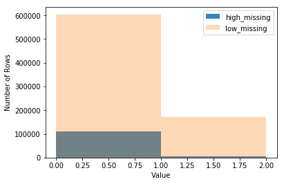

# Identification of Customer Segments

In this project, I applied unsupervised learning techniques to identify segments of the population that form the core customer base for a mail-order sales company in Germany. These segments are used to direct marketing campaigns toward audiences with the highest expected return rate. Bertelsmann Arvato Analytics has provided the data.


```python
import numpy as np
import pandas as pd
import matplotlib.pyplot as plt
import seaborn as sns
from matplotlib import pyplot
from sklearn.preprocessing import Imputer, StandardScaler
from sklearn.decomposition import PCA
from sklearn.cluster import KMeans, MiniBatchKMeans

# magic word for producing visualizations in notebook
%matplotlib inline
```

### Step 0: Load the Data

There are four files associated with this project (not including this one):

- `Udacity_AZDIAS_Subset.csv`: Demographics data for the general population of Germany; 891211 persons (rows) x 85 features (columns).
- `Udacity_CUSTOMERS_Subset.csv`: Demographics data for customers of a mail-order company; 191652 persons (rows) x 85 features (columns).
- `Data_Dictionary.md`: Detailed information file about the features in the provided datasets.
- `AZDIAS_Feature_Summary.csv`: Summary of feature attributes for demographics data; 85 features (rows) x 4 columns


```python
# Load in the general demographics data.
azdias = pd.read_csv('Udacity_AZDIAS_Subset.csv', sep=';')

# Load in the feature summary file.
feat_info = pd.read_table('AZDIAS_Feature_Summary.csv',sep=';')
```


```python
# Check the structure of the data after it's loaded (e.g. print the number of
# rows and columns, print the first few rows).
azdias.head(3)

```


<div>
<style scoped>
    .dataframe tbody tr th:only-of-type {
        vertical-align: middle;
    }

    .dataframe tbody tr th {
        vertical-align: top;
    }

    .dataframe thead th {
        text-align: right;
    }
</style>
<table border="1" class="dataframe">
  <thead>
    <tr style="text-align: right;">
      <th></th>
      <th>AGER_TYP</th>
      <th>ALTERSKATEGORIE_GROB</th>
      <th>ANREDE_KZ</th>
      <th>CJT_GESAMTTYP</th>
      <th>FINANZ_MINIMALIST</th>
      <th>FINANZ_SPARER</th>
      <th>FINANZ_VORSORGER</th>
      <th>FINANZ_ANLEGER</th>
      <th>FINANZ_UNAUFFAELLIGER</th>
      <th>FINANZ_HAUSBAUER</th>
      <th>...</th>
      <th>PLZ8_ANTG1</th>
      <th>PLZ8_ANTG2</th>
      <th>PLZ8_ANTG3</th>
      <th>PLZ8_ANTG4</th>
      <th>PLZ8_BAUMAX</th>
      <th>PLZ8_HHZ</th>
      <th>PLZ8_GBZ</th>
      <th>ARBEIT</th>
      <th>ORTSGR_KLS9</th>
      <th>RELAT_AB</th>
    </tr>
  </thead>
  <tbody>
    <tr>
      <th>0</th>
      <td>-1</td>
      <td>2</td>
      <td>1</td>
      <td>2.0</td>
      <td>3</td>
      <td>4</td>
      <td>3</td>
      <td>5</td>
      <td>5</td>
      <td>3</td>
      <td>...</td>
      <td>NaN</td>
      <td>NaN</td>
      <td>NaN</td>
      <td>NaN</td>
      <td>NaN</td>
      <td>NaN</td>
      <td>NaN</td>
      <td>NaN</td>
      <td>NaN</td>
      <td>NaN</td>
    </tr>
    <tr>
      <th>1</th>
      <td>-1</td>
      <td>1</td>
      <td>2</td>
      <td>5.0</td>
      <td>1</td>
      <td>5</td>
      <td>2</td>
      <td>5</td>
      <td>4</td>
      <td>5</td>
      <td>...</td>
      <td>2.0</td>
      <td>3.0</td>
      <td>2.0</td>
      <td>1.0</td>
      <td>1.0</td>
      <td>5.0</td>
      <td>4.0</td>
      <td>3.0</td>
      <td>5.0</td>
      <td>4.0</td>
    </tr>
    <tr>
      <th>2</th>
      <td>-1</td>
      <td>3</td>
      <td>2</td>
      <td>3.0</td>
      <td>1</td>
      <td>4</td>
      <td>1</td>
      <td>2</td>
      <td>3</td>
      <td>5</td>
      <td>...</td>
      <td>3.0</td>
      <td>3.0</td>
      <td>1.0</td>
      <td>0.0</td>
      <td>1.0</td>
      <td>4.0</td>
      <td>4.0</td>
      <td>3.0</td>
      <td>5.0</td>
      <td>2.0</td>
    </tr>
  </tbody>
</table>
<p>3 rows × 85 columns</p>
</div>


```python
feat_info.head(3)
```


<div>
<style scoped>
    .dataframe tbody tr th:only-of-type {
        vertical-align: middle;
    }

    .dataframe tbody tr th {
        vertical-align: top;
    }

    .dataframe thead th {
        text-align: right;
    }
</style>
<table border="1" class="dataframe">
  <thead>
    <tr style="text-align: right;">
      <th></th>
      <th>attribute</th>
      <th>information_level</th>
      <th>type</th>
      <th>missing_or_unknown</th>
    </tr>
  </thead>
  <tbody>
    <tr>
      <th>0</th>
      <td>AGER_TYP</td>
      <td>person</td>
      <td>categorical</td>
      <td>[-1,0]</td>
    </tr>
    <tr>
      <th>1</th>
      <td>ALTERSKATEGORIE_GROB</td>
      <td>person</td>
      <td>ordinal</td>
      <td>[-1,0,9]</td>
    </tr>
    <tr>
      <th>2</th>
      <td>ANREDE_KZ</td>
      <td>person</td>
      <td>categorical</td>
      <td>[-1,0]</td>
    </tr>
  </tbody>
</table>
</div>


```python
azdias.describe()
```


<div>
<style scoped>
    .dataframe tbody tr th:only-of-type {
        vertical-align: middle;
    }

    .dataframe tbody tr th {
        vertical-align: top;
    }

    .dataframe thead th {
        text-align: right;
    }
</style>
<table border="1" class="dataframe">
  <thead>
    <tr style="text-align: right;">
      <th></th>
      <th>AGER_TYP</th>
      <th>ALTERSKATEGORIE_GROB</th>
      <th>ANREDE_KZ</th>
      <th>CJT_GESAMTTYP</th>
      <th>FINANZ_MINIMALIST</th>
      <th>FINANZ_SPARER</th>
      <th>FINANZ_VORSORGER</th>
      <th>FINANZ_ANLEGER</th>
      <th>FINANZ_UNAUFFAELLIGER</th>
      <th>FINANZ_HAUSBAUER</th>
      <th>...</th>
      <th>PLZ8_ANTG1</th>
      <th>PLZ8_ANTG2</th>
      <th>PLZ8_ANTG3</th>
      <th>PLZ8_ANTG4</th>
      <th>PLZ8_BAUMAX</th>
      <th>PLZ8_HHZ</th>
      <th>PLZ8_GBZ</th>
      <th>ARBEIT</th>
      <th>ORTSGR_KLS9</th>
      <th>RELAT_AB</th>
    </tr>
  </thead>
  <tbody>
    <tr>
      <th>count</th>
      <td>891221.000000</td>
      <td>891221.000000</td>
      <td>891221.000000</td>
      <td>886367.000000</td>
      <td>891221.000000</td>
      <td>891221.000000</td>
      <td>891221.000000</td>
      <td>891221.000000</td>
      <td>891221.000000</td>
      <td>891221.000000</td>
      <td>...</td>
      <td>774706.000000</td>
      <td>774706.000000</td>
      <td>774706.000000</td>
      <td>774706.000000</td>
      <td>774706.000000</td>
      <td>774706.000000</td>
      <td>774706.000000</td>
      <td>794005.000000</td>
      <td>794005.000000</td>
      <td>794005.00000</td>
    </tr>
    <tr>
      <th>mean</th>
      <td>-0.358435</td>
      <td>2.777398</td>
      <td>1.522098</td>
      <td>3.632838</td>
      <td>3.074528</td>
      <td>2.821039</td>
      <td>3.401106</td>
      <td>3.033328</td>
      <td>2.874167</td>
      <td>3.075121</td>
      <td>...</td>
      <td>2.253330</td>
      <td>2.801858</td>
      <td>1.595426</td>
      <td>0.699166</td>
      <td>1.943913</td>
      <td>3.612821</td>
      <td>3.381087</td>
      <td>3.167854</td>
      <td>5.293002</td>
      <td>3.07222</td>
    </tr>
    <tr>
      <th>std</th>
      <td>1.198724</td>
      <td>1.068775</td>
      <td>0.499512</td>
      <td>1.595021</td>
      <td>1.321055</td>
      <td>1.464749</td>
      <td>1.322134</td>
      <td>1.529603</td>
      <td>1.486731</td>
      <td>1.353248</td>
      <td>...</td>
      <td>0.972008</td>
      <td>0.920309</td>
      <td>0.986736</td>
      <td>0.727137</td>
      <td>1.459654</td>
      <td>0.973967</td>
      <td>1.111598</td>
      <td>1.002376</td>
      <td>2.303739</td>
      <td>1.36298</td>
    </tr>
    <tr>
      <th>min</th>
      <td>-1.000000</td>
      <td>1.000000</td>
      <td>1.000000</td>
      <td>1.000000</td>
      <td>1.000000</td>
      <td>1.000000</td>
      <td>1.000000</td>
      <td>1.000000</td>
      <td>1.000000</td>
      <td>1.000000</td>
      <td>...</td>
      <td>0.000000</td>
      <td>0.000000</td>
      <td>0.000000</td>
      <td>0.000000</td>
      <td>1.000000</td>
      <td>1.000000</td>
      <td>1.000000</td>
      <td>1.000000</td>
      <td>0.000000</td>
      <td>1.00000</td>
    </tr>
    <tr>
      <th>25%</th>
      <td>-1.000000</td>
      <td>2.000000</td>
      <td>1.000000</td>
      <td>2.000000</td>
      <td>2.000000</td>
      <td>1.000000</td>
      <td>3.000000</td>
      <td>2.000000</td>
      <td>2.000000</td>
      <td>2.000000</td>
      <td>...</td>
      <td>1.000000</td>
      <td>2.000000</td>
      <td>1.000000</td>
      <td>0.000000</td>
      <td>1.000000</td>
      <td>3.000000</td>
      <td>3.000000</td>
      <td>3.000000</td>
      <td>4.000000</td>
      <td>2.00000</td>
    </tr>
    <tr>
      <th>50%</th>
      <td>-1.000000</td>
      <td>3.000000</td>
      <td>2.000000</td>
      <td>4.000000</td>
      <td>3.000000</td>
      <td>3.000000</td>
      <td>3.000000</td>
      <td>3.000000</td>
      <td>3.000000</td>
      <td>3.000000</td>
      <td>...</td>
      <td>2.000000</td>
      <td>3.000000</td>
      <td>2.000000</td>
      <td>1.000000</td>
      <td>1.000000</td>
      <td>4.000000</td>
      <td>3.000000</td>
      <td>3.000000</td>
      <td>5.000000</td>
      <td>3.00000</td>
    </tr>
    <tr>
      <th>75%</th>
      <td>-1.000000</td>
      <td>4.000000</td>
      <td>2.000000</td>
      <td>5.000000</td>
      <td>4.000000</td>
      <td>4.000000</td>
      <td>5.000000</td>
      <td>5.000000</td>
      <td>4.000000</td>
      <td>4.000000</td>
      <td>...</td>
      <td>3.000000</td>
      <td>3.000000</td>
      <td>2.000000</td>
      <td>1.000000</td>
      <td>3.000000</td>
      <td>4.000000</td>
      <td>4.000000</td>
      <td>4.000000</td>
      <td>7.000000</td>
      <td>4.00000</td>
    </tr>
    <tr>
      <th>max</th>
      <td>3.000000</td>
      <td>9.000000</td>
      <td>2.000000</td>
      <td>6.000000</td>
      <td>5.000000</td>
      <td>5.000000</td>
      <td>5.000000</td>
      <td>5.000000</td>
      <td>5.000000</td>
      <td>5.000000</td>
      <td>...</td>
      <td>4.000000</td>
      <td>4.000000</td>
      <td>3.000000</td>
      <td>2.000000</td>
      <td>5.000000</td>
      <td>5.000000</td>
      <td>5.000000</td>
      <td>9.000000</td>
      <td>9.000000</td>
      <td>9.00000</td>
    </tr>
  </tbody>
</table>
<p>8 rows × 81 columns</p>
</div>


```python
feat_info.describe()
```


<div>
<style scoped>
    .dataframe tbody tr th:only-of-type {
        vertical-align: middle;
    }

    .dataframe tbody tr th {
        vertical-align: top;
    }

    .dataframe thead th {
        text-align: right;
    }
</style>
<table border="1" class="dataframe">
  <thead>
    <tr style="text-align: right;">
      <th></th>
      <th>attribute</th>
      <th>information_level</th>
      <th>type</th>
      <th>missing_or_unknown</th>
    </tr>
  </thead>
  <tbody>
    <tr>
      <th>count</th>
      <td>85</td>
      <td>85</td>
      <td>85</td>
      <td>85</td>
    </tr>
    <tr>
      <th>unique</th>
      <td>85</td>
      <td>9</td>
      <td>5</td>
      <td>9</td>
    </tr>
    <tr>
      <th>top</th>
      <td>FINANZ_VORSORGER</td>
      <td>person</td>
      <td>ordinal</td>
      <td>[-1]</td>
    </tr>
    <tr>
      <th>freq</th>
      <td>1</td>
      <td>43</td>
      <td>49</td>
      <td>26</td>
    </tr>
  </tbody>
</table>
</div>


```python
feat_info.info()
```

    <class 'pandas.core.frame.DataFrame'>
    RangeIndex: 85 entries, 0 to 84
    Data columns (total 4 columns):
    attribute             85 non-null object
    information_level     85 non-null object
    type                  85 non-null object
    missing_or_unknown    85 non-null object
    dtypes: object(4)
    memory usage: 2.7+ KB


## Step 1: Preprocessing

### Step 1.1: Assess Missing Data

The feature summary file contains a summary of properties for each demographics data column. I used this file to help make cleaning decisions during this stage of the project. 
#### Step 1.1.1: Convert Missing Value Codes to NaNs
The fourth column of the feature attributes summary (loaded in above as `feat_info`) documents the codes from the data dictionary that indicate missing or unknown data. While the file encodes this as a list (e.g. `[-1,0]`), this will get read in as a string object. 


```python
for columns in range(len(feat_info)):
    column_name=azdias.columns[columns]
    miss_l = feat_info.iloc[columns,3].replace('[', '').replace(']', '').split(',')
    if len(miss_l[0]) > 0:
        for el in miss_l:
            if azdias[column_name].dtype =='object':
                azdias.loc[azdias[column_name]==el,column_name]=np.nan 
            else:   
                el=int(el)
                azdias.loc[azdias[column_name]==el,column_name]=np.nan
    else:
        continue
        
```


```python
azdias.head()
```


<div>
<style scoped>
    .dataframe tbody tr th:only-of-type {
        vertical-align: middle;
    }

    .dataframe tbody tr th {
        vertical-align: top;
    }

    .dataframe thead th {
        text-align: right;
    }
</style>
<table border="1" class="dataframe">
  <thead>
    <tr style="text-align: right;">
      <th></th>
      <th>AGER_TYP</th>
      <th>ALTERSKATEGORIE_GROB</th>
      <th>ANREDE_KZ</th>
      <th>CJT_GESAMTTYP</th>
      <th>FINANZ_MINIMALIST</th>
      <th>FINANZ_SPARER</th>
      <th>FINANZ_VORSORGER</th>
      <th>FINANZ_ANLEGER</th>
      <th>FINANZ_UNAUFFAELLIGER</th>
      <th>FINANZ_HAUSBAUER</th>
      <th>...</th>
      <th>PLZ8_ANTG1</th>
      <th>PLZ8_ANTG2</th>
      <th>PLZ8_ANTG3</th>
      <th>PLZ8_ANTG4</th>
      <th>PLZ8_BAUMAX</th>
      <th>PLZ8_HHZ</th>
      <th>PLZ8_GBZ</th>
      <th>ARBEIT</th>
      <th>ORTSGR_KLS9</th>
      <th>RELAT_AB</th>
    </tr>
  </thead>
  <tbody>
    <tr>
      <th>0</th>
      <td>NaN</td>
      <td>2.0</td>
      <td>1.0</td>
      <td>2.0</td>
      <td>3.0</td>
      <td>4.0</td>
      <td>3.0</td>
      <td>5.0</td>
      <td>5.0</td>
      <td>3.0</td>
      <td>...</td>
      <td>NaN</td>
      <td>NaN</td>
      <td>NaN</td>
      <td>NaN</td>
      <td>NaN</td>
      <td>NaN</td>
      <td>NaN</td>
      <td>NaN</td>
      <td>NaN</td>
      <td>NaN</td>
    </tr>
    <tr>
      <th>1</th>
      <td>NaN</td>
      <td>1.0</td>
      <td>2.0</td>
      <td>5.0</td>
      <td>1.0</td>
      <td>5.0</td>
      <td>2.0</td>
      <td>5.0</td>
      <td>4.0</td>
      <td>5.0</td>
      <td>...</td>
      <td>2.0</td>
      <td>3.0</td>
      <td>2.0</td>
      <td>1.0</td>
      <td>1.0</td>
      <td>5.0</td>
      <td>4.0</td>
      <td>3.0</td>
      <td>5.0</td>
      <td>4.0</td>
    </tr>
    <tr>
      <th>2</th>
      <td>NaN</td>
      <td>3.0</td>
      <td>2.0</td>
      <td>3.0</td>
      <td>1.0</td>
      <td>4.0</td>
      <td>1.0</td>
      <td>2.0</td>
      <td>3.0</td>
      <td>5.0</td>
      <td>...</td>
      <td>3.0</td>
      <td>3.0</td>
      <td>1.0</td>
      <td>0.0</td>
      <td>1.0</td>
      <td>4.0</td>
      <td>4.0</td>
      <td>3.0</td>
      <td>5.0</td>
      <td>2.0</td>
    </tr>
    <tr>
      <th>3</th>
      <td>2.0</td>
      <td>4.0</td>
      <td>2.0</td>
      <td>2.0</td>
      <td>4.0</td>
      <td>2.0</td>
      <td>5.0</td>
      <td>2.0</td>
      <td>1.0</td>
      <td>2.0</td>
      <td>...</td>
      <td>2.0</td>
      <td>2.0</td>
      <td>2.0</td>
      <td>0.0</td>
      <td>1.0</td>
      <td>3.0</td>
      <td>4.0</td>
      <td>2.0</td>
      <td>3.0</td>
      <td>3.0</td>
    </tr>
    <tr>
      <th>4</th>
      <td>NaN</td>
      <td>3.0</td>
      <td>1.0</td>
      <td>5.0</td>
      <td>4.0</td>
      <td>3.0</td>
      <td>4.0</td>
      <td>1.0</td>
      <td>3.0</td>
      <td>2.0</td>
      <td>...</td>
      <td>2.0</td>
      <td>4.0</td>
      <td>2.0</td>
      <td>1.0</td>
      <td>2.0</td>
      <td>3.0</td>
      <td>3.0</td>
      <td>4.0</td>
      <td>6.0</td>
      <td>5.0</td>
    </tr>
  </tbody>
</table>
<p>5 rows × 85 columns</p>
</div>


```python
print(azdias.isnull().sum())
```

    AGER_TYP                 685843
    ALTERSKATEGORIE_GROB       2881
    ANREDE_KZ                     0
    CJT_GESAMTTYP              4854
    FINANZ_MINIMALIST             0
    FINANZ_SPARER                 0
    FINANZ_VORSORGER              0
    FINANZ_ANLEGER                0
    FINANZ_UNAUFFAELLIGER         0
    FINANZ_HAUSBAUER              0
    FINANZTYP                     0
    GEBURTSJAHR              392318
    GFK_URLAUBERTYP            4854
    GREEN_AVANTGARDE              0
    HEALTH_TYP               111196
    LP_LEBENSPHASE_FEIN       97632
    LP_LEBENSPHASE_GROB       94572
    LP_FAMILIE_FEIN           77792
    LP_FAMILIE_GROB           77792
    LP_STATUS_FEIN             4854
    LP_STATUS_GROB             4854
    NATIONALITAET_KZ         108315
    PRAEGENDE_JUGENDJAHRE    108164
    RETOURTYP_BK_S             4854
    SEMIO_SOZ                     0
    SEMIO_FAM                     0
    SEMIO_REL                     0
    SEMIO_MAT                     0
    SEMIO_VERT                    0
    SEMIO_LUST                    0
                              ...  
    OST_WEST_KZ               93148
    WOHNLAGE                  93148
    CAMEO_DEUG_2015           99352
    CAMEO_DEU_2015            99352
    CAMEO_INTL_2015           99352
    KBA05_ANTG1              133324
    KBA05_ANTG2              133324
    KBA05_ANTG3              133324
    KBA05_ANTG4              133324
    KBA05_BAUMAX             476524
    KBA05_GBZ                133324
    BALLRAUM                  93740
    EWDICHTE                  93740
    INNENSTADT                93740
    GEBAEUDETYP_RASTER        93155
    KKK                      158064
    MOBI_REGIO               133324
    ONLINE_AFFINITAET          4854
    REGIOTYP                 158064
    KBA13_ANZAHL_PKW         105800
    PLZ8_ANTG1               116515
    PLZ8_ANTG2               116515
    PLZ8_ANTG3               116515
    PLZ8_ANTG4               116515
    PLZ8_BAUMAX              116515
    PLZ8_HHZ                 116515
    PLZ8_GBZ                 116515
    ARBEIT                    97375
    ORTSGR_KLS9               97274
    RELAT_AB                  97375
    Length: 85, dtype: int64


#### Step 1.1.2: Assess Missing Data in Each Column

How much missing data is present in each column? There are a few columns that are outliers in terms of the proportion of values that are missing. I want to use matplotlib'function to visualize the distribution of missing value counts to find these columns. 


```python
# Performing an assessment of how much missing data there is in each column of the
# dataset.
missing_per_col = azdias.isnull().sum()/len(azdias)
missing_per_col.head(50)
```


    AGER_TYP                 0.769554
    ALTERSKATEGORIE_GROB     0.003233
    ANREDE_KZ                0.000000
    CJT_GESAMTTYP            0.005446
    FINANZ_MINIMALIST        0.000000
    FINANZ_SPARER            0.000000
    FINANZ_VORSORGER         0.000000
    FINANZ_ANLEGER           0.000000
    FINANZ_UNAUFFAELLIGER    0.000000
    FINANZ_HAUSBAUER         0.000000
    FINANZTYP                0.000000
    GEBURTSJAHR              0.440203
    GFK_URLAUBERTYP          0.005446
    GREEN_AVANTGARDE         0.000000
    HEALTH_TYP               0.124768
    LP_LEBENSPHASE_FEIN      0.109549
    LP_LEBENSPHASE_GROB      0.106115
    LP_FAMILIE_FEIN          0.087287
    LP_FAMILIE_GROB          0.087287
    LP_STATUS_FEIN           0.005446
    LP_STATUS_GROB           0.005446
    NATIONALITAET_KZ         0.121536
    PRAEGENDE_JUGENDJAHRE    0.121366
    RETOURTYP_BK_S           0.005446
    SEMIO_SOZ                0.000000
    SEMIO_FAM                0.000000
    SEMIO_REL                0.000000
    SEMIO_MAT                0.000000
    SEMIO_VERT               0.000000
    SEMIO_LUST               0.000000
    SEMIO_ERL                0.000000
    SEMIO_KULT               0.000000
    SEMIO_RAT                0.000000
    SEMIO_KRIT               0.000000
    SEMIO_DOM                0.000000
    SEMIO_KAEM               0.000000
    SEMIO_PFLICHT            0.000000
    SEMIO_TRADV              0.000000
    SHOPPER_TYP              0.124768
    SOHO_KZ                  0.082470
    TITEL_KZ                 0.997576
    VERS_TYP                 0.124768
    ZABEOTYP                 0.000000
    ALTER_HH                 0.348137
    ANZ_PERSONEN             0.082470
    ANZ_TITEL                0.082470
    HH_EINKOMMEN_SCORE       0.020587
    KK_KUNDENTYP             0.655967
    W_KEIT_KIND_HH           0.166051
    WOHNDAUER_2008           0.082470
    dtype: float64


```python
# Investigation patterns in the amount of missing data in each column.
plt.hist(missing_per_col, bins=20)
plt.ylabel('columns')
plt.xlabel('Ratio of Missing Values')
plt.show()
```


```python
# Removinge the outlier columns from the dataset. 
missed_per_column = missing_per_col [missing_per_col > 0.3]
coloumns_to_drop = missed_per_column.index.tolist()
coloumns_to_drop

```


    ['AGER_TYP',
     'GEBURTSJAHR',
     'TITEL_KZ',
     'ALTER_HH',
     'KK_KUNDENTYP',
     'KBA05_BAUMAX']


```python
azdias = azdias.drop(coloumns_to_drop, axis=1)
```


```python
azdias.head(3)
```


<div>
<style scoped>
    .dataframe tbody tr th:only-of-type {
        vertical-align: middle;
    }

    .dataframe tbody tr th {
        vertical-align: top;
    }

    .dataframe thead th {
        text-align: right;
    }
</style>
<table border="1" class="dataframe">
  <thead>
    <tr style="text-align: right;">
      <th></th>
      <th>ALTERSKATEGORIE_GROB</th>
      <th>ANREDE_KZ</th>
      <th>CJT_GESAMTTYP</th>
      <th>FINANZ_MINIMALIST</th>
      <th>FINANZ_SPARER</th>
      <th>FINANZ_VORSORGER</th>
      <th>FINANZ_ANLEGER</th>
      <th>FINANZ_UNAUFFAELLIGER</th>
      <th>FINANZ_HAUSBAUER</th>
      <th>FINANZTYP</th>
      <th>...</th>
      <th>PLZ8_ANTG1</th>
      <th>PLZ8_ANTG2</th>
      <th>PLZ8_ANTG3</th>
      <th>PLZ8_ANTG4</th>
      <th>PLZ8_BAUMAX</th>
      <th>PLZ8_HHZ</th>
      <th>PLZ8_GBZ</th>
      <th>ARBEIT</th>
      <th>ORTSGR_KLS9</th>
      <th>RELAT_AB</th>
    </tr>
  </thead>
  <tbody>
    <tr>
      <th>0</th>
      <td>2.0</td>
      <td>1.0</td>
      <td>2.0</td>
      <td>3.0</td>
      <td>4.0</td>
      <td>3.0</td>
      <td>5.0</td>
      <td>5.0</td>
      <td>3.0</td>
      <td>4.0</td>
      <td>...</td>
      <td>NaN</td>
      <td>NaN</td>
      <td>NaN</td>
      <td>NaN</td>
      <td>NaN</td>
      <td>NaN</td>
      <td>NaN</td>
      <td>NaN</td>
      <td>NaN</td>
      <td>NaN</td>
    </tr>
    <tr>
      <th>1</th>
      <td>1.0</td>
      <td>2.0</td>
      <td>5.0</td>
      <td>1.0</td>
      <td>5.0</td>
      <td>2.0</td>
      <td>5.0</td>
      <td>4.0</td>
      <td>5.0</td>
      <td>1.0</td>
      <td>...</td>
      <td>2.0</td>
      <td>3.0</td>
      <td>2.0</td>
      <td>1.0</td>
      <td>1.0</td>
      <td>5.0</td>
      <td>4.0</td>
      <td>3.0</td>
      <td>5.0</td>
      <td>4.0</td>
    </tr>
    <tr>
      <th>2</th>
      <td>3.0</td>
      <td>2.0</td>
      <td>3.0</td>
      <td>1.0</td>
      <td>4.0</td>
      <td>1.0</td>
      <td>2.0</td>
      <td>3.0</td>
      <td>5.0</td>
      <td>1.0</td>
      <td>...</td>
      <td>3.0</td>
      <td>3.0</td>
      <td>1.0</td>
      <td>0.0</td>
      <td>1.0</td>
      <td>4.0</td>
      <td>4.0</td>
      <td>3.0</td>
      <td>5.0</td>
      <td>2.0</td>
    </tr>
  </tbody>
</table>
<p>3 rows × 79 columns</p>
</div>


#### Discussion 1.1.2: Assess Missing Data in Each Column

Most of the columns have less than 0.17 missing values. It's questionable that columns with missing values will give us a noticeable advantage. So we are droping columns 'AGER_TYP',  'GEBURTSJAHR',  'TITEL_KZ',  'ALTER_HH',  'KK_KUNDENTYP', and 'KBA05_BAUMAX'.
Talking about patterns, it's evident that some of the columns have the same missing ratio, for example, CAMEO_DEUG_2015, CAMEO_DEU_2015, and CAMEO_INTL_2015. They are presenting the same information in different dimensions.

#### Step 1.1.3: Assess Missing Data in Each Row


```python
# How much data is missing in each row of the dataset?
missing_in_row = azdias.isnull().sum(axis=1)
total_r_with_missed_v = missing_in_row[missing_in_row>0].count()
total_r_with_missed_v
```


    268012


```python
plt.hist(missing_in_row, bins=20)
plt.ylabel('Rows')
plt.xlabel('Sum of Missing Values')
plt.show()
```


```python
# Rows quantity with more than 9 missed values per row.
total_r_with_missed_v_3 = missing_in_row[missing_in_row>3].count()
total_r_with_missed_v_3
```


    206719


```python
# Rows quantity with more than 9 missed values per row.
total_r_with_missed_v_9 = missing_in_row[missing_in_row>9].count()
total_r_with_missed_v_9
```


    116478


Taking into account the above plot and the fact that with 9 missed values we will have 2 times fewer dropped rows, I decided to go further with a maximum of 9 missed values per row.


```python
# Write code to divide the data into two subsets based on the number of missing
# values in each row.
azdias_high_missing = azdias[azdias.isnull().sum(axis=1) > 9]
azdias_low_missing = azdias[azdias.isnull().sum(axis=1) <= 9]


```


```python
# Compare the distribution of values for at least five columns where there are
# no or few missing values, between the two subsets.
bins = np.linspace(0, 8, 8)

pyplot.hist(azdias_high_missing['SEMIO_SOZ'], bins, alpha=0.9, label='high_missing')
pyplot.hist(azdias_low_missing['SEMIO_SOZ'], bins, alpha=0.3, label='low_missing')
pyplot.legend(loc='upper right')
pyplot.ylabel('Number of Rows')
pyplot.xlabel('Value')
pyplot.show()


```


```python
bins = np.linspace(0, 6, 6)

pyplot.hist(azdias_high_missing['FINANZ_MINIMALIST'], bins, alpha=0.9, label='high_missing')
pyplot.hist(azdias_low_missing['FINANZ_MINIMALIST'], bins, alpha=0.3, label='low_missing')
pyplot.legend(loc='upper right')
pyplot.ylabel('Number of Rows')
pyplot.xlabel('Value')
pyplot.show()


```


```python
bins = np.linspace(0, 2, 3)

pyplot.hist(azdias_high_missing['GREEN_AVANTGARDE'], bins, alpha=0.9, label='high_missing')
pyplot.hist(azdias_low_missing['GREEN_AVANTGARDE'], bins, alpha=0.3, label='low_missing')
pyplot.legend(loc='upper right')
pyplot.ylabel('Number of Rows')
pyplot.xlabel('Value')
pyplot.show()

```





```python
bins = np.linspace(1 , 2, 3)

pyplot.hist(azdias_high_missing['ANREDE_KZ'], bins, alpha=0.9, label='high_missing')
pyplot.hist(azdias_low_missing['ANREDE_KZ'], bins, alpha=0.3, label='low_missing')
pyplot.legend(loc='upper right')
pyplot.ylabel('Number of Rows')
pyplot.xlabel('Value')
pyplot.show()


```


```python
bins = np.linspace(0, 8, 8)

pyplot.hist(azdias_high_missing['SEMIO_PFLICHT'], bins, alpha=0.9, label='high_missing')
pyplot.hist(azdias_low_missing['SEMIO_PFLICHT'], bins, alpha=0.3, label='low_missing')
pyplot.legend(loc='upper right')
pyplot.ylabel('Number of Rows')
pyplot.xlabel('Value')
pyplot.show()


```


#### Discussion 1.1.3: Assess Missing Data in Each Row

Some columns have the same distribution in both subsets: ANREDE_KZ,GREEN_AVANTGARDE, FINANZ_MINIMALIST. One column has a slightly different distribution but has the same mode:SEMIO_SOZ. And one of them have significantly other distribution:  SEMIO_PFLICHT even has a different mode.

### Step 1.2: Select and Re-Encode Features


```python
# How many features are there of each data type?
feat_info.groupby(['type'])['attribute'].count()

```


    type
    categorical    21
    interval        1
    mixed           7
    numeric         7
    ordinal        49
    Name: attribute, dtype: int64


#### Step 1.2.1: Re-Encode Categorical Features

For categorical data, you would ordinarily need to encode the levels as dummy variables. Depending on the number of categories, perform one of the following:
- For binary (two-level) categoricals that take numeric values, you can keep them without needing to do anything.
- There is one binary variable that takes on non-numeric values. For this one, you need to re-encode the values as numbers or create a dummy variable.
- For multi-level categoricals (three or more values), you can choose to encode the values using multiple dummy variables (e.g. via [OneHotEncoder](http://scikit-learn.org/stable/modules/generated/sklearn.preprocessing.OneHotEncoder.html)), or (to keep things straightforward) just drop them from the analysis. As always, document your choices in the Discussion section.


```python
# Assess categorical variables: which are binary, which are multi-level, and
# which one needs to be re-encoded
actual_features = list(azdias_low_missing.columns)
actual_features

```


    ['ALTERSKATEGORIE_GROB',
     'ANREDE_KZ',
     'CJT_GESAMTTYP',
     'FINANZ_MINIMALIST',
     'FINANZ_SPARER',
     'FINANZ_VORSORGER',
     'FINANZ_ANLEGER',
     'FINANZ_UNAUFFAELLIGER',
     'FINANZ_HAUSBAUER',
     'FINANZTYP',
     'GFK_URLAUBERTYP',
     'GREEN_AVANTGARDE',
     'HEALTH_TYP',
     'LP_LEBENSPHASE_FEIN',
     'LP_LEBENSPHASE_GROB',
     'LP_FAMILIE_FEIN',
     'LP_FAMILIE_GROB',
     'LP_STATUS_FEIN',
     'LP_STATUS_GROB',
     'NATIONALITAET_KZ',
     'PRAEGENDE_JUGENDJAHRE',
     'RETOURTYP_BK_S',
     'SEMIO_SOZ',
     'SEMIO_FAM',
     'SEMIO_REL',
     'SEMIO_MAT',
     'SEMIO_VERT',
     'SEMIO_LUST',
     'SEMIO_ERL',
     'SEMIO_KULT',
     'SEMIO_RAT',
     'SEMIO_KRIT',
     'SEMIO_DOM',
     'SEMIO_KAEM',
     'SEMIO_PFLICHT',
     'SEMIO_TRADV',
     'SHOPPER_TYP',
     'SOHO_KZ',
     'VERS_TYP',
     'ZABEOTYP',
     'ANZ_PERSONEN',
     'ANZ_TITEL',
     'HH_EINKOMMEN_SCORE',
     'W_KEIT_KIND_HH',
     'WOHNDAUER_2008',
     'ANZ_HAUSHALTE_AKTIV',
     'ANZ_HH_TITEL',
     'GEBAEUDETYP',
     'KONSUMNAEHE',
     'MIN_GEBAEUDEJAHR',
     'OST_WEST_KZ',
     'WOHNLAGE',
     'CAMEO_DEUG_2015',
     'CAMEO_DEU_2015',
     'CAMEO_INTL_2015',
     'KBA05_ANTG1',
     'KBA05_ANTG2',
     'KBA05_ANTG3',
     'KBA05_ANTG4',
     'KBA05_GBZ',
     'BALLRAUM',
     'EWDICHTE',
     'INNENSTADT',
     'GEBAEUDETYP_RASTER',
     'KKK',
     'MOBI_REGIO',
     'ONLINE_AFFINITAET',
     'REGIOTYP',
     'KBA13_ANZAHL_PKW',
     'PLZ8_ANTG1',
     'PLZ8_ANTG2',
     'PLZ8_ANTG3',
     'PLZ8_ANTG4',
     'PLZ8_BAUMAX',
     'PLZ8_HHZ',
     'PLZ8_GBZ',
     'ARBEIT',
     'ORTSGR_KLS9',
     'RELAT_AB']


```python
categorical_f = feat_info[feat_info['attribute'].isin(actual_features) & (feat_info['type'] == 'categorical')]
categorical_f
```


<div>
<style scoped>
    .dataframe tbody tr th:only-of-type {
        vertical-align: middle;
    }

    .dataframe tbody tr th {
        vertical-align: top;
    }

    .dataframe thead th {
        text-align: right;
    }
</style>
<table border="1" class="dataframe">
  <thead>
    <tr style="text-align: right;">
      <th></th>
      <th>attribute</th>
      <th>information_level</th>
      <th>type</th>
      <th>missing_or_unknown</th>
    </tr>
  </thead>
  <tbody>
    <tr>
      <th>2</th>
      <td>ANREDE_KZ</td>
      <td>person</td>
      <td>categorical</td>
      <td>[-1,0]</td>
    </tr>
    <tr>
      <th>3</th>
      <td>CJT_GESAMTTYP</td>
      <td>person</td>
      <td>categorical</td>
      <td>[0]</td>
    </tr>
    <tr>
      <th>10</th>
      <td>FINANZTYP</td>
      <td>person</td>
      <td>categorical</td>
      <td>[-1]</td>
    </tr>
    <tr>
      <th>12</th>
      <td>GFK_URLAUBERTYP</td>
      <td>person</td>
      <td>categorical</td>
      <td>[]</td>
    </tr>
    <tr>
      <th>13</th>
      <td>GREEN_AVANTGARDE</td>
      <td>person</td>
      <td>categorical</td>
      <td>[]</td>
    </tr>
    <tr>
      <th>17</th>
      <td>LP_FAMILIE_FEIN</td>
      <td>person</td>
      <td>categorical</td>
      <td>[0]</td>
    </tr>
    <tr>
      <th>18</th>
      <td>LP_FAMILIE_GROB</td>
      <td>person</td>
      <td>categorical</td>
      <td>[0]</td>
    </tr>
    <tr>
      <th>19</th>
      <td>LP_STATUS_FEIN</td>
      <td>person</td>
      <td>categorical</td>
      <td>[0]</td>
    </tr>
    <tr>
      <th>20</th>
      <td>LP_STATUS_GROB</td>
      <td>person</td>
      <td>categorical</td>
      <td>[0]</td>
    </tr>
    <tr>
      <th>21</th>
      <td>NATIONALITAET_KZ</td>
      <td>person</td>
      <td>categorical</td>
      <td>[-1,0]</td>
    </tr>
    <tr>
      <th>38</th>
      <td>SHOPPER_TYP</td>
      <td>person</td>
      <td>categorical</td>
      <td>[-1]</td>
    </tr>
    <tr>
      <th>39</th>
      <td>SOHO_KZ</td>
      <td>person</td>
      <td>categorical</td>
      <td>[-1]</td>
    </tr>
    <tr>
      <th>41</th>
      <td>VERS_TYP</td>
      <td>person</td>
      <td>categorical</td>
      <td>[-1]</td>
    </tr>
    <tr>
      <th>42</th>
      <td>ZABEOTYP</td>
      <td>person</td>
      <td>categorical</td>
      <td>[-1,9]</td>
    </tr>
    <tr>
      <th>52</th>
      <td>GEBAEUDETYP</td>
      <td>building</td>
      <td>categorical</td>
      <td>[-1,0]</td>
    </tr>
    <tr>
      <th>55</th>
      <td>OST_WEST_KZ</td>
      <td>building</td>
      <td>categorical</td>
      <td>[-1]</td>
    </tr>
    <tr>
      <th>57</th>
      <td>CAMEO_DEUG_2015</td>
      <td>microcell_rr4</td>
      <td>categorical</td>
      <td>[-1,X]</td>
    </tr>
    <tr>
      <th>58</th>
      <td>CAMEO_DEU_2015</td>
      <td>microcell_rr4</td>
      <td>categorical</td>
      <td>[XX]</td>
    </tr>
  </tbody>
</table>
</div>


```python
categorical_columns = categorical_f['attribute']
categorical_columns
```


    2            ANREDE_KZ
    3        CJT_GESAMTTYP
    10           FINANZTYP
    12     GFK_URLAUBERTYP
    13    GREEN_AVANTGARDE
    17     LP_FAMILIE_FEIN
    18     LP_FAMILIE_GROB
    19      LP_STATUS_FEIN
    20      LP_STATUS_GROB
    21    NATIONALITAET_KZ
    38         SHOPPER_TYP
    39             SOHO_KZ
    41            VERS_TYP
    42            ZABEOTYP
    52         GEBAEUDETYP
    55         OST_WEST_KZ
    57     CAMEO_DEUG_2015
    58      CAMEO_DEU_2015
    Name: attribute, dtype: object


```python
values_q = azdias_low_missing[categorical_columns].nunique()  #quantity of unique values
values_q
```


    ANREDE_KZ            2
    CJT_GESAMTTYP        6
    FINANZTYP            6
    GFK_URLAUBERTYP     12
    GREEN_AVANTGARDE     2
    LP_FAMILIE_FEIN     11
    LP_FAMILIE_GROB      5
    LP_STATUS_FEIN      10
    LP_STATUS_GROB       5
    NATIONALITAET_KZ     3
    SHOPPER_TYP          4
    SOHO_KZ              2
    VERS_TYP             2
    ZABEOTYP             6
    GEBAEUDETYP          7
    OST_WEST_KZ          2
    CAMEO_DEUG_2015      9
    CAMEO_DEU_2015      44
    dtype: int64


```python
binary_cat = values_q.where(values_q  == 2)[values_q.where(values_q   == 2).notna()].index.tolist()
binary_cat #binary categorical variables
```


    ['ANREDE_KZ', 'GREEN_AVANTGARDE', 'SOHO_KZ', 'VERS_TYP', 'OST_WEST_KZ']


```python
multilevel_cat =  values_q.where(values_q  > 2)[values_q.where(values_q   > 2).notna()].index.tolist()
multilevel_cat
```


    ['CJT_GESAMTTYP',
     'FINANZTYP',
     'GFK_URLAUBERTYP',
     'LP_FAMILIE_FEIN',
     'LP_FAMILIE_GROB',
     'LP_STATUS_FEIN',
     'LP_STATUS_GROB',
     'NATIONALITAET_KZ',
     'SHOPPER_TYP',
     'ZABEOTYP',
     'GEBAEUDETYP',
     'CAMEO_DEUG_2015',
     'CAMEO_DEU_2015']


```python
# List of multilevel categorical variables, which I will keep:
multilevel_to_keep = values_q.where((values_q  > 2) & (values_q  < 7) )[values_q.where((values_q   > 2) & (values_q  < 7)).notna()].index.tolist()
multilevel_to_keep
```


    ['CJT_GESAMTTYP',
     'FINANZTYP',
     'LP_FAMILIE_GROB',
     'LP_STATUS_GROB',
     'NATIONALITAET_KZ',
     'SHOPPER_TYP',
     'ZABEOTYP']


```python
# List of multilevel categorical variables, which I will drop:
multilevel_to_drop = list(set(multilevel_cat).difference(set(multilevel_to_keep)))
multilevel_to_drop
```


    ['GEBAEUDETYP',
     'LP_STATUS_FEIN',
     'CAMEO_DEUG_2015',
     'CAMEO_DEU_2015',
     'GFK_URLAUBERTYP',
     'LP_FAMILIE_FEIN']


```python
for el in binary_cat + multilevel_to_keep:
    print('column: ', el, 'values: ', azdias_low_missing[el].unique())
```

    column:  ANREDE_KZ values:  [ 2.  1.]
    column:  GREEN_AVANTGARDE values:  [0 1]
    column:  SOHO_KZ values:  [ 1.  0.]
    column:  VERS_TYP values:  [  2.   1.  nan]
    column:  OST_WEST_KZ values:  ['W' 'O']
    column:  CJT_GESAMTTYP values:  [ 5.  3.  2.  4.  1.  6.]
    column:  FINANZTYP values:  [ 1.  6.  5.  2.  4.  3.]
    column:  LP_FAMILIE_GROB values:  [  3.   1.  nan   5.   2.   4.]
    column:  LP_STATUS_GROB values:  [ 1.  2.  4.  5.  3.]
    column:  NATIONALITAET_KZ values:  [  1.   3.   2.  nan]
    column:  SHOPPER_TYP values:  [  3.   2.   1.   0.  nan]
    column:  ZABEOTYP values:  [ 5.  3.  4.  1.  6.  2.]


```python
azdias_clean = azdias_low_missing.copy()
```


```python
#drop
for el in multilevel_to_drop:
    azdias_clean=azdias_clean.drop(el, axis=1)
```


```python
# Re-encoding binary cat variable to be kept in the analysis.

OST_WEST_KZ_reenc = {'W': 1, 'O': 0}
azdias_clean = azdias_clean.replace({'OST_WEST_KZ':OST_WEST_KZ_reenc})
```


```python
#Hot encode multilevel variables:
for el in multilevel_to_keep:
    el_dummies = pd.get_dummies(azdias_clean[el], prefix=el)
    azdias_clean = pd.concat([azdias_clean, el_dummies], axis=1)
azdias_clean.head()
```


<div>
<style scoped>
    .dataframe tbody tr th:only-of-type {
        vertical-align: middle;
    }

    .dataframe tbody tr th {
        vertical-align: top;
    }

    .dataframe thead th {
        text-align: right;
    }
</style>
<table border="1" class="dataframe">
  <thead>
    <tr style="text-align: right;">
      <th></th>
      <th>ALTERSKATEGORIE_GROB</th>
      <th>ANREDE_KZ</th>
      <th>CJT_GESAMTTYP</th>
      <th>FINANZ_MINIMALIST</th>
      <th>FINANZ_SPARER</th>
      <th>FINANZ_VORSORGER</th>
      <th>FINANZ_ANLEGER</th>
      <th>FINANZ_UNAUFFAELLIGER</th>
      <th>FINANZ_HAUSBAUER</th>
      <th>FINANZTYP</th>
      <th>...</th>
      <th>SHOPPER_TYP_0.0</th>
      <th>SHOPPER_TYP_1.0</th>
      <th>SHOPPER_TYP_2.0</th>
      <th>SHOPPER_TYP_3.0</th>
      <th>ZABEOTYP_1.0</th>
      <th>ZABEOTYP_2.0</th>
      <th>ZABEOTYP_3.0</th>
      <th>ZABEOTYP_4.0</th>
      <th>ZABEOTYP_5.0</th>
      <th>ZABEOTYP_6.0</th>
    </tr>
  </thead>
  <tbody>
    <tr>
      <th>1</th>
      <td>1.0</td>
      <td>2.0</td>
      <td>5.0</td>
      <td>1.0</td>
      <td>5.0</td>
      <td>2.0</td>
      <td>5.0</td>
      <td>4.0</td>
      <td>5.0</td>
      <td>1.0</td>
      <td>...</td>
      <td>0</td>
      <td>0</td>
      <td>0</td>
      <td>1</td>
      <td>0</td>
      <td>0</td>
      <td>0</td>
      <td>0</td>
      <td>1</td>
      <td>0</td>
    </tr>
    <tr>
      <th>2</th>
      <td>3.0</td>
      <td>2.0</td>
      <td>3.0</td>
      <td>1.0</td>
      <td>4.0</td>
      <td>1.0</td>
      <td>2.0</td>
      <td>3.0</td>
      <td>5.0</td>
      <td>1.0</td>
      <td>...</td>
      <td>0</td>
      <td>0</td>
      <td>1</td>
      <td>0</td>
      <td>0</td>
      <td>0</td>
      <td>0</td>
      <td>0</td>
      <td>1</td>
      <td>0</td>
    </tr>
    <tr>
      <th>3</th>
      <td>4.0</td>
      <td>2.0</td>
      <td>2.0</td>
      <td>4.0</td>
      <td>2.0</td>
      <td>5.0</td>
      <td>2.0</td>
      <td>1.0</td>
      <td>2.0</td>
      <td>6.0</td>
      <td>...</td>
      <td>0</td>
      <td>1</td>
      <td>0</td>
      <td>0</td>
      <td>0</td>
      <td>0</td>
      <td>1</td>
      <td>0</td>
      <td>0</td>
      <td>0</td>
    </tr>
    <tr>
      <th>4</th>
      <td>3.0</td>
      <td>1.0</td>
      <td>5.0</td>
      <td>4.0</td>
      <td>3.0</td>
      <td>4.0</td>
      <td>1.0</td>
      <td>3.0</td>
      <td>2.0</td>
      <td>5.0</td>
      <td>...</td>
      <td>0</td>
      <td>0</td>
      <td>1</td>
      <td>0</td>
      <td>0</td>
      <td>0</td>
      <td>0</td>
      <td>1</td>
      <td>0</td>
      <td>0</td>
    </tr>
    <tr>
      <th>5</th>
      <td>1.0</td>
      <td>2.0</td>
      <td>2.0</td>
      <td>3.0</td>
      <td>1.0</td>
      <td>5.0</td>
      <td>2.0</td>
      <td>2.0</td>
      <td>5.0</td>
      <td>2.0</td>
      <td>...</td>
      <td>1</td>
      <td>0</td>
      <td>0</td>
      <td>0</td>
      <td>0</td>
      <td>0</td>
      <td>0</td>
      <td>1</td>
      <td>0</td>
      <td>0</td>
    </tr>
  </tbody>
</table>
<p>5 rows × 108 columns</p>
</div>


```python
#Drop multilevel:
for el in multilevel_to_keep:
    azdias_clean=azdias_clean.drop(el, axis=1)
azdias_clean.head()
```


<div>
<style scoped>
    .dataframe tbody tr th:only-of-type {
        vertical-align: middle;
    }

    .dataframe tbody tr th {
        vertical-align: top;
    }

    .dataframe thead th {
        text-align: right;
    }
</style>
<table border="1" class="dataframe">
  <thead>
    <tr style="text-align: right;">
      <th></th>
      <th>ALTERSKATEGORIE_GROB</th>
      <th>ANREDE_KZ</th>
      <th>FINANZ_MINIMALIST</th>
      <th>FINANZ_SPARER</th>
      <th>FINANZ_VORSORGER</th>
      <th>FINANZ_ANLEGER</th>
      <th>FINANZ_UNAUFFAELLIGER</th>
      <th>FINANZ_HAUSBAUER</th>
      <th>GREEN_AVANTGARDE</th>
      <th>HEALTH_TYP</th>
      <th>...</th>
      <th>SHOPPER_TYP_0.0</th>
      <th>SHOPPER_TYP_1.0</th>
      <th>SHOPPER_TYP_2.0</th>
      <th>SHOPPER_TYP_3.0</th>
      <th>ZABEOTYP_1.0</th>
      <th>ZABEOTYP_2.0</th>
      <th>ZABEOTYP_3.0</th>
      <th>ZABEOTYP_4.0</th>
      <th>ZABEOTYP_5.0</th>
      <th>ZABEOTYP_6.0</th>
    </tr>
  </thead>
  <tbody>
    <tr>
      <th>1</th>
      <td>1.0</td>
      <td>2.0</td>
      <td>1.0</td>
      <td>5.0</td>
      <td>2.0</td>
      <td>5.0</td>
      <td>4.0</td>
      <td>5.0</td>
      <td>0</td>
      <td>3.0</td>
      <td>...</td>
      <td>0</td>
      <td>0</td>
      <td>0</td>
      <td>1</td>
      <td>0</td>
      <td>0</td>
      <td>0</td>
      <td>0</td>
      <td>1</td>
      <td>0</td>
    </tr>
    <tr>
      <th>2</th>
      <td>3.0</td>
      <td>2.0</td>
      <td>1.0</td>
      <td>4.0</td>
      <td>1.0</td>
      <td>2.0</td>
      <td>3.0</td>
      <td>5.0</td>
      <td>1</td>
      <td>3.0</td>
      <td>...</td>
      <td>0</td>
      <td>0</td>
      <td>1</td>
      <td>0</td>
      <td>0</td>
      <td>0</td>
      <td>0</td>
      <td>0</td>
      <td>1</td>
      <td>0</td>
    </tr>
    <tr>
      <th>3</th>
      <td>4.0</td>
      <td>2.0</td>
      <td>4.0</td>
      <td>2.0</td>
      <td>5.0</td>
      <td>2.0</td>
      <td>1.0</td>
      <td>2.0</td>
      <td>0</td>
      <td>2.0</td>
      <td>...</td>
      <td>0</td>
      <td>1</td>
      <td>0</td>
      <td>0</td>
      <td>0</td>
      <td>0</td>
      <td>1</td>
      <td>0</td>
      <td>0</td>
      <td>0</td>
    </tr>
    <tr>
      <th>4</th>
      <td>3.0</td>
      <td>1.0</td>
      <td>4.0</td>
      <td>3.0</td>
      <td>4.0</td>
      <td>1.0</td>
      <td>3.0</td>
      <td>2.0</td>
      <td>0</td>
      <td>3.0</td>
      <td>...</td>
      <td>0</td>
      <td>0</td>
      <td>1</td>
      <td>0</td>
      <td>0</td>
      <td>0</td>
      <td>0</td>
      <td>1</td>
      <td>0</td>
      <td>0</td>
    </tr>
    <tr>
      <th>5</th>
      <td>1.0</td>
      <td>2.0</td>
      <td>3.0</td>
      <td>1.0</td>
      <td>5.0</td>
      <td>2.0</td>
      <td>2.0</td>
      <td>5.0</td>
      <td>0</td>
      <td>3.0</td>
      <td>...</td>
      <td>1</td>
      <td>0</td>
      <td>0</td>
      <td>0</td>
      <td>0</td>
      <td>0</td>
      <td>0</td>
      <td>1</td>
      <td>0</td>
      <td>0</td>
    </tr>
  </tbody>
</table>
<p>5 rows × 101 columns</p>
</div>


#### Discussion 1.2.1: Re-Encode Categorical Features

I re-encoded the binary feature 'OST_WEST_KZ'. Then I decided to keep all multi-level categorical features with less than seven distinct values 'CJT_GESAMTTYP',  'FINANZTYP',  'LP_FAMILIE_GROB',  'LP_STATUS_GROB',  'NATIONALITAET_KZ',  'SHOPPER_TYP',  'ZABEOTYP'. Then I dropped all other multi-level features:'CAMEO_DEUG_2015',  'LP_STATUS_FEIN',  'GFK_URLAUBERTYP', 'LP_FAMILIE_FEIN',  'GEBAEUDETYP',  'CAMEO_DEU_2015'.


#### Step 1.2.2: Engineer Mixed-Type Features

There are a handful of features that are marked as "mixed" in the feature summary that require special treatment in order to be included in the analysis. There are two in particular that deserve attention; the handling of the rest are up to your own choices:
- "PRAEGENDE_JUGENDJAHRE" combines information on three dimensions: generation by decade, movement (mainstream vs. avantgarde), and nation (east vs. west). 
- "CAMEO_INTL_2015" combines information on two axes: wealth and life stage. 


```python
# Investigate "PRAEGENDE_JUGENDJAHRE" and engineer two new variables.
# new varibales: 'MAINSTREAM_AVANTGARDE' and DECADE
azdias_clean.loc[azdias_clean['PRAEGENDE_JUGENDJAHRE'].isin([1,3,5,8,10,12,14]),'MAINSTREAM_AVANTGARDE']=2
azdias_clean.loc[azdias_clean['PRAEGENDE_JUGENDJAHRE'].isin([2,4,6,7,9,11,13,15]),'MAINSTREAM_AVANTGARDE']=1

azdias_clean.loc[azdias_clean['PRAEGENDE_JUGENDJAHRE'].isin([1,2]),'DECADE']=70
azdias_clean.loc[azdias_clean['PRAEGENDE_JUGENDJAHRE'].isin([3,4]),'DECADE']=60
azdias_clean.loc[azdias_clean['PRAEGENDE_JUGENDJAHRE'].isin([5,6,7]),'DECADE']=50
azdias_clean.loc[azdias_clean['PRAEGENDE_JUGENDJAHRE'].isin([8,9]),'DECADE']=40
azdias_clean.loc[azdias_clean['PRAEGENDE_JUGENDJAHRE'].isin([10,11,12,13]),'DECADE']=30
azdias_clean.loc[azdias_clean['PRAEGENDE_JUGENDJAHRE'].isin([14,15]),'DECADE']=20
azdias_clean.head()

```


<div>
<style scoped>
    .dataframe tbody tr th:only-of-type {
        vertical-align: middle;
    }

    .dataframe tbody tr th {
        vertical-align: top;
    }

    .dataframe thead th {
        text-align: right;
    }
</style>
<table border="1" class="dataframe">
  <thead>
    <tr style="text-align: right;">
      <th></th>
      <th>ALTERSKATEGORIE_GROB</th>
      <th>ANREDE_KZ</th>
      <th>FINANZ_MINIMALIST</th>
      <th>FINANZ_SPARER</th>
      <th>FINANZ_VORSORGER</th>
      <th>FINANZ_ANLEGER</th>
      <th>FINANZ_UNAUFFAELLIGER</th>
      <th>FINANZ_HAUSBAUER</th>
      <th>GREEN_AVANTGARDE</th>
      <th>HEALTH_TYP</th>
      <th>...</th>
      <th>SHOPPER_TYP_2.0</th>
      <th>SHOPPER_TYP_3.0</th>
      <th>ZABEOTYP_1.0</th>
      <th>ZABEOTYP_2.0</th>
      <th>ZABEOTYP_3.0</th>
      <th>ZABEOTYP_4.0</th>
      <th>ZABEOTYP_5.0</th>
      <th>ZABEOTYP_6.0</th>
      <th>MAINSTREAM_AVANTGARDE</th>
      <th>DECADE</th>
    </tr>
  </thead>
  <tbody>
    <tr>
      <th>1</th>
      <td>1.0</td>
      <td>2.0</td>
      <td>1.0</td>
      <td>5.0</td>
      <td>2.0</td>
      <td>5.0</td>
      <td>4.0</td>
      <td>5.0</td>
      <td>0</td>
      <td>3.0</td>
      <td>...</td>
      <td>0</td>
      <td>1</td>
      <td>0</td>
      <td>0</td>
      <td>0</td>
      <td>0</td>
      <td>1</td>
      <td>0</td>
      <td>2.0</td>
      <td>20.0</td>
    </tr>
    <tr>
      <th>2</th>
      <td>3.0</td>
      <td>2.0</td>
      <td>1.0</td>
      <td>4.0</td>
      <td>1.0</td>
      <td>2.0</td>
      <td>3.0</td>
      <td>5.0</td>
      <td>1</td>
      <td>3.0</td>
      <td>...</td>
      <td>1</td>
      <td>0</td>
      <td>0</td>
      <td>0</td>
      <td>0</td>
      <td>0</td>
      <td>1</td>
      <td>0</td>
      <td>1.0</td>
      <td>20.0</td>
    </tr>
    <tr>
      <th>3</th>
      <td>4.0</td>
      <td>2.0</td>
      <td>4.0</td>
      <td>2.0</td>
      <td>5.0</td>
      <td>2.0</td>
      <td>1.0</td>
      <td>2.0</td>
      <td>0</td>
      <td>2.0</td>
      <td>...</td>
      <td>0</td>
      <td>0</td>
      <td>0</td>
      <td>0</td>
      <td>1</td>
      <td>0</td>
      <td>0</td>
      <td>0</td>
      <td>2.0</td>
      <td>40.0</td>
    </tr>
    <tr>
      <th>4</th>
      <td>3.0</td>
      <td>1.0</td>
      <td>4.0</td>
      <td>3.0</td>
      <td>4.0</td>
      <td>1.0</td>
      <td>3.0</td>
      <td>2.0</td>
      <td>0</td>
      <td>3.0</td>
      <td>...</td>
      <td>1</td>
      <td>0</td>
      <td>0</td>
      <td>0</td>
      <td>0</td>
      <td>1</td>
      <td>0</td>
      <td>0</td>
      <td>2.0</td>
      <td>40.0</td>
    </tr>
    <tr>
      <th>5</th>
      <td>1.0</td>
      <td>2.0</td>
      <td>3.0</td>
      <td>1.0</td>
      <td>5.0</td>
      <td>2.0</td>
      <td>2.0</td>
      <td>5.0</td>
      <td>0</td>
      <td>3.0</td>
      <td>...</td>
      <td>0</td>
      <td>0</td>
      <td>0</td>
      <td>0</td>
      <td>0</td>
      <td>1</td>
      <td>0</td>
      <td>0</td>
      <td>2.0</td>
      <td>60.0</td>
    </tr>
  </tbody>
</table>
<p>5 rows × 103 columns</p>
</div>


```python
# Investigate "CAMEO_INTL_2015" and engineer two new variables.
# new varibales: 'FAMILY_WEALTH' and FAMILY_LIFE_STAGE
azdias_clean.loc[azdias_clean['CAMEO_INTL_2015'].isin(['51','52','53','54','55']),'FAMILY_WEALTH']=1
azdias_clean.loc[azdias_clean['CAMEO_INTL_2015'].isin(['41','42','43','44','45']),'FAMILY_WEALTH']=2
azdias_clean.loc[azdias_clean['CAMEO_INTL_2015'].isin(['31','32','33','34','35']),'FAMILY_WEALTH']=3
azdias_clean.loc[azdias_clean['CAMEO_INTL_2015'].isin(['21','22','23','24','25']),'FAMILY_WEALTH']=4
azdias_clean.loc[azdias_clean['CAMEO_INTL_2015'].isin(['11','12','13','14','15']),'FAMILY_WEALTH']=5

azdias_clean.loc[azdias_clean['CAMEO_INTL_2015'].isin(['11','21','31','41','51']),'FAMILY_LIFE_STAGE']=1
azdias_clean.loc[azdias_clean['CAMEO_INTL_2015'].isin(['12','22','32','42','52']),'FAMILY_LIFE_STAGE']=2
azdias_clean.loc[azdias_clean['CAMEO_INTL_2015'].isin(['13','23','33','43','53']),'FAMILY_LIFE_STAGE']=3
azdias_clean.loc[azdias_clean['CAMEO_INTL_2015'].isin(['14','24','34','44','54']),'FAMILY_LIFE_STAGE']=4
azdias_clean.loc[azdias_clean['CAMEO_INTL_2015'].isin(['15','25','35','45','55']),'FAMILY_LIFE_STAGE']=5

azdias_clean.head()


```


<div>
<style scoped>
    .dataframe tbody tr th:only-of-type {
        vertical-align: middle;
    }

    .dataframe tbody tr th {
        vertical-align: top;
    }

    .dataframe thead th {
        text-align: right;
    }
</style>
<table border="1" class="dataframe">
  <thead>
    <tr style="text-align: right;">
      <th></th>
      <th>ALTERSKATEGORIE_GROB</th>
      <th>ANREDE_KZ</th>
      <th>FINANZ_MINIMALIST</th>
      <th>FINANZ_SPARER</th>
      <th>FINANZ_VORSORGER</th>
      <th>FINANZ_ANLEGER</th>
      <th>FINANZ_UNAUFFAELLIGER</th>
      <th>FINANZ_HAUSBAUER</th>
      <th>GREEN_AVANTGARDE</th>
      <th>HEALTH_TYP</th>
      <th>...</th>
      <th>ZABEOTYP_1.0</th>
      <th>ZABEOTYP_2.0</th>
      <th>ZABEOTYP_3.0</th>
      <th>ZABEOTYP_4.0</th>
      <th>ZABEOTYP_5.0</th>
      <th>ZABEOTYP_6.0</th>
      <th>MAINSTREAM_AVANTGARDE</th>
      <th>DECADE</th>
      <th>FAMILY_WEALTH</th>
      <th>FAMILY_LIFE_STAGE</th>
    </tr>
  </thead>
  <tbody>
    <tr>
      <th>1</th>
      <td>1.0</td>
      <td>2.0</td>
      <td>1.0</td>
      <td>5.0</td>
      <td>2.0</td>
      <td>5.0</td>
      <td>4.0</td>
      <td>5.0</td>
      <td>0</td>
      <td>3.0</td>
      <td>...</td>
      <td>0</td>
      <td>0</td>
      <td>0</td>
      <td>0</td>
      <td>1</td>
      <td>0</td>
      <td>2.0</td>
      <td>20.0</td>
      <td>1.0</td>
      <td>1.0</td>
    </tr>
    <tr>
      <th>2</th>
      <td>3.0</td>
      <td>2.0</td>
      <td>1.0</td>
      <td>4.0</td>
      <td>1.0</td>
      <td>2.0</td>
      <td>3.0</td>
      <td>5.0</td>
      <td>1</td>
      <td>3.0</td>
      <td>...</td>
      <td>0</td>
      <td>0</td>
      <td>0</td>
      <td>0</td>
      <td>1</td>
      <td>0</td>
      <td>1.0</td>
      <td>20.0</td>
      <td>4.0</td>
      <td>4.0</td>
    </tr>
    <tr>
      <th>3</th>
      <td>4.0</td>
      <td>2.0</td>
      <td>4.0</td>
      <td>2.0</td>
      <td>5.0</td>
      <td>2.0</td>
      <td>1.0</td>
      <td>2.0</td>
      <td>0</td>
      <td>2.0</td>
      <td>...</td>
      <td>0</td>
      <td>0</td>
      <td>1</td>
      <td>0</td>
      <td>0</td>
      <td>0</td>
      <td>2.0</td>
      <td>40.0</td>
      <td>5.0</td>
      <td>2.0</td>
    </tr>
    <tr>
      <th>4</th>
      <td>3.0</td>
      <td>1.0</td>
      <td>4.0</td>
      <td>3.0</td>
      <td>4.0</td>
      <td>1.0</td>
      <td>3.0</td>
      <td>2.0</td>
      <td>0</td>
      <td>3.0</td>
      <td>...</td>
      <td>0</td>
      <td>0</td>
      <td>0</td>
      <td>1</td>
      <td>0</td>
      <td>0</td>
      <td>2.0</td>
      <td>40.0</td>
      <td>2.0</td>
      <td>3.0</td>
    </tr>
    <tr>
      <th>5</th>
      <td>1.0</td>
      <td>2.0</td>
      <td>3.0</td>
      <td>1.0</td>
      <td>5.0</td>
      <td>2.0</td>
      <td>2.0</td>
      <td>5.0</td>
      <td>0</td>
      <td>3.0</td>
      <td>...</td>
      <td>0</td>
      <td>0</td>
      <td>0</td>
      <td>1</td>
      <td>0</td>
      <td>0</td>
      <td>2.0</td>
      <td>60.0</td>
      <td>1.0</td>
      <td>4.0</td>
    </tr>
  </tbody>
</table>
<p>5 rows × 105 columns</p>
</div>


#### Discussion 1.2.2: Engineer Mixed-Type Features

I decided to keep two mixed features: PRAEGENDE_JUGENDJAHRE and CAMEO_INTL_2015 and drop all others. I created four new features and assigned them new matching values using Data_Dictionary.md as a reference to perform the above. I will drop all mixed on the next step.

#### Step 1.2.3: Complete Feature Selection


```python
mixed_to_drop = feat_info[feat_info['attribute'].isin(actual_features) & \
                          (feat_info['type'] == 'mixed')]['attribute'].tolist()

for el in mixed_to_drop:
    azdias_clean.drop(el, axis=1, inplace=True)
azdias_clean.head(5)
```


<div>
<style scoped>
    .dataframe tbody tr th:only-of-type {
        vertical-align: middle;
    }

    .dataframe tbody tr th {
        vertical-align: top;
    }

    .dataframe thead th {
        text-align: right;
    }
</style>
<table border="1" class="dataframe">
  <thead>
    <tr style="text-align: right;">
      <th></th>
      <th>ALTERSKATEGORIE_GROB</th>
      <th>ANREDE_KZ</th>
      <th>FINANZ_MINIMALIST</th>
      <th>FINANZ_SPARER</th>
      <th>FINANZ_VORSORGER</th>
      <th>FINANZ_ANLEGER</th>
      <th>FINANZ_UNAUFFAELLIGER</th>
      <th>FINANZ_HAUSBAUER</th>
      <th>GREEN_AVANTGARDE</th>
      <th>HEALTH_TYP</th>
      <th>...</th>
      <th>ZABEOTYP_1.0</th>
      <th>ZABEOTYP_2.0</th>
      <th>ZABEOTYP_3.0</th>
      <th>ZABEOTYP_4.0</th>
      <th>ZABEOTYP_5.0</th>
      <th>ZABEOTYP_6.0</th>
      <th>MAINSTREAM_AVANTGARDE</th>
      <th>DECADE</th>
      <th>FAMILY_WEALTH</th>
      <th>FAMILY_LIFE_STAGE</th>
    </tr>
  </thead>
  <tbody>
    <tr>
      <th>1</th>
      <td>1.0</td>
      <td>2.0</td>
      <td>1.0</td>
      <td>5.0</td>
      <td>2.0</td>
      <td>5.0</td>
      <td>4.0</td>
      <td>5.0</td>
      <td>0</td>
      <td>3.0</td>
      <td>...</td>
      <td>0</td>
      <td>0</td>
      <td>0</td>
      <td>0</td>
      <td>1</td>
      <td>0</td>
      <td>2.0</td>
      <td>20.0</td>
      <td>1.0</td>
      <td>1.0</td>
    </tr>
    <tr>
      <th>2</th>
      <td>3.0</td>
      <td>2.0</td>
      <td>1.0</td>
      <td>4.0</td>
      <td>1.0</td>
      <td>2.0</td>
      <td>3.0</td>
      <td>5.0</td>
      <td>1</td>
      <td>3.0</td>
      <td>...</td>
      <td>0</td>
      <td>0</td>
      <td>0</td>
      <td>0</td>
      <td>1</td>
      <td>0</td>
      <td>1.0</td>
      <td>20.0</td>
      <td>4.0</td>
      <td>4.0</td>
    </tr>
    <tr>
      <th>3</th>
      <td>4.0</td>
      <td>2.0</td>
      <td>4.0</td>
      <td>2.0</td>
      <td>5.0</td>
      <td>2.0</td>
      <td>1.0</td>
      <td>2.0</td>
      <td>0</td>
      <td>2.0</td>
      <td>...</td>
      <td>0</td>
      <td>0</td>
      <td>1</td>
      <td>0</td>
      <td>0</td>
      <td>0</td>
      <td>2.0</td>
      <td>40.0</td>
      <td>5.0</td>
      <td>2.0</td>
    </tr>
    <tr>
      <th>4</th>
      <td>3.0</td>
      <td>1.0</td>
      <td>4.0</td>
      <td>3.0</td>
      <td>4.0</td>
      <td>1.0</td>
      <td>3.0</td>
      <td>2.0</td>
      <td>0</td>
      <td>3.0</td>
      <td>...</td>
      <td>0</td>
      <td>0</td>
      <td>0</td>
      <td>1</td>
      <td>0</td>
      <td>0</td>
      <td>2.0</td>
      <td>40.0</td>
      <td>2.0</td>
      <td>3.0</td>
    </tr>
    <tr>
      <th>5</th>
      <td>1.0</td>
      <td>2.0</td>
      <td>3.0</td>
      <td>1.0</td>
      <td>5.0</td>
      <td>2.0</td>
      <td>2.0</td>
      <td>5.0</td>
      <td>0</td>
      <td>3.0</td>
      <td>...</td>
      <td>0</td>
      <td>0</td>
      <td>0</td>
      <td>1</td>
      <td>0</td>
      <td>0</td>
      <td>2.0</td>
      <td>60.0</td>
      <td>1.0</td>
      <td>4.0</td>
    </tr>
  </tbody>
</table>
<p>5 rows × 99 columns</p>
</div>


### Step 1.3: Creation a Cleaning Function


```python
def clean_data(df, multil_to_keep, coloumns_to_drop, categorical_columns, binary_cat, multilevel_cat, max_missing = 9):

    """
   
    INPUT: Demographics DataFrame, list of: columns to drop, categorical columns, \
    binary features, mulilevel, max quantity of missed values in a row
    OUTPUT: Trimmed and cleaned demographics DataFrame
    """
    
    # Put in code here to execute all main cleaning steps:
    # convert missing value codes into NaNs, ...
    for columns in range(len(feat_info)):
        column_name=df.columns[columns]
        #print(column_name)
        miss_l = feat_info.iloc[columns,3].replace('[', '').replace(']', '').split(',')
        if len(miss_l[0]) > 0:
            for el in miss_l:
                if df[column_name].dtype =='object':
                    df.loc[df[column_name]==el,column_name]=np.nan 
                else:   
                    el=int(el)
                    df.loc[df[column_name]==el,column_name]=np.nan
        else:
            continue
    
    
    # remove selected columns and rows, ...
    coloumns_to_drop = missed_per_column.index.tolist()
    df = df.drop(coloumns_to_drop, axis=1)
    missing_in_row = df.isnull().sum(axis=1)
    total_r_with_missed_v = missing_in_row[missing_in_row>0].count()
    df_low_missing = df[df.isnull().sum(axis=1) <= max_missing]
    # select, re-encode, and engineer column values.
    actual_features = list(df_low_missing.columns)
    categorical_columns = feat_info[feat_info['attribute'].isin(actual_features) & (feat_info['type'] == 'categorical')]['attribute']
    multilevel_to_drop = list(set(multilevel_cat).difference(set(multilevel_to_keep)))
    df_clean = df_low_missing.copy()
    # drop multilevel_to_drop:
    for el in multilevel_to_drop:
        df_clean=df_clean.drop(el, axis=1)

    #Re-encode binary cat variable to be kept in the analysis.
    OST_WEST_KZ_reenc = {'W': 1, 'O': 0}
    df_clean = df_clean.replace({'OST_WEST_KZ':OST_WEST_KZ_reenc})
        
    #Hot encode multilevel variables:
    for el in multilevel_to_keep:
        el_dummies = pd.get_dummies(df_clean[el], prefix=el)
        df_clean = pd.concat([df_clean, el_dummies], axis=1)
        df_clean=df_clean.drop(el, axis=1)
    
    # Investigate "PRAEGENDE_JUGENDJAHRE" and engineer two new variables.
    # new varibales: 'MAINSTREAM_AVANTGARDE' and DECADE
    df_clean.loc[df_clean['PRAEGENDE_JUGENDJAHRE'].isin([1,3,5,8,10,12,14]),'MAINSTREAM_AVANTGARDE']=2
    df_clean.loc[df_clean['PRAEGENDE_JUGENDJAHRE'].isin([2,4,6,7,9,11,13,15]),'MAINSTREAM_AVANTGARDE']=1

    df_clean.loc[df_clean['PRAEGENDE_JUGENDJAHRE'].isin([1,2]),'DECADE']=70
    df_clean.loc[df_clean['PRAEGENDE_JUGENDJAHRE'].isin([3,4]),'DECADE']=60
    df_clean.loc[df_clean['PRAEGENDE_JUGENDJAHRE'].isin([5,6,7]),'DECADE']=50
    df_clean.loc[df_clean['PRAEGENDE_JUGENDJAHRE'].isin([8,9]),'DECADE']=40
    df_clean.loc[df_clean['PRAEGENDE_JUGENDJAHRE'].isin([10,11,12,13]),'DECADE']=30
    df_clean.loc[df_clean['PRAEGENDE_JUGENDJAHRE'].isin([14,15]),'DECADE']=20
    
    # Investigate "CAMEO_INTL_2015" and engineer two new variables.
    # new varibales: 'FAMILY_WEALTH' and FAMILY_LIFE_STAGE
    df_clean.loc[df_clean['CAMEO_INTL_2015'].isin(['51','52','53','54','55']),'FAMILY_WEALTH']=1
    df_clean.loc[df_clean['CAMEO_INTL_2015'].isin(['41','42','43','44','45']),'FAMILY_WEALTH']=2
    df_clean.loc[df_clean['CAMEO_INTL_2015'].isin(['31','32','33','34','35']),'FAMILY_WEALTH']=3
    df_clean.loc[df_clean['CAMEO_INTL_2015'].isin(['21','22','23','24','25']),'FAMILY_WEALTH']=4
    df_clean.loc[df_clean['CAMEO_INTL_2015'].isin(['11','12','13','14','15']),'FAMILY_WEALTH']=5

    df_clean.loc[df_clean['CAMEO_INTL_2015'].isin(['11','21','31','41','51']),'FAMILY_LIFE_STAGE']=1
    df_clean.loc[df_clean['CAMEO_INTL_2015'].isin(['12','22','32','42','52']),'FAMILY_LIFE_STAGE']=2
    df_clean.loc[df_clean['CAMEO_INTL_2015'].isin(['13','23','33','43','53']),'FAMILY_LIFE_STAGE']=3
    df_clean.loc[df_clean['CAMEO_INTL_2015'].isin(['14','24','34','44','54']),'FAMILY_LIFE_STAGE']=4
    df_clean.loc[df_clean['CAMEO_INTL_2015'].isin(['15','25','35','45','55']),'FAMILY_LIFE_STAGE']=5

  
    mixed_to_drop = feat_info[feat_info['attribute'].isin(actual_features) & \
                              (feat_info['type'] == 'mixed')]['attribute'].tolist()

    for el in mixed_to_drop:
        df_clean.drop(el, axis=1, inplace=True)
    
    # Return the cleaned dataframe.
    
    return df_clean
    
    
```

## Step 2: Feature Transformation

### Step 2.1: Apply Feature Scaling


```python
imputer = Imputer(strategy='most_frequent')
azdias_clean_imputed = pd.DataFrame(imputer.fit_transform(azdias_clean))
azdias_clean_imputed.columns = azdias_clean.columns
azdias_clean_imputed.index = azdias_clean.index
```


```python
# Applying feature scaling to the general population demographics data.
scaler = StandardScaler() 
azdias_clean_scaled = scaler.fit_transform(azdias_clean_imputed)
azdias_clean_scaled = pd.DataFrame(azdias_clean_scaled)
azdias_clean_scaled.columns = azdias_clean_imputed.columns
azdias_clean_scaled.head(5)

```


<div>
<style scoped>
    .dataframe tbody tr th:only-of-type {
        vertical-align: middle;
    }

    .dataframe tbody tr th {
        vertical-align: top;
    }

    .dataframe thead th {
        text-align: right;
    }
</style>
<table border="1" class="dataframe">
  <thead>
    <tr style="text-align: right;">
      <th></th>
      <th>ALTERSKATEGORIE_GROB</th>
      <th>ANREDE_KZ</th>
      <th>FINANZ_MINIMALIST</th>
      <th>FINANZ_SPARER</th>
      <th>FINANZ_VORSORGER</th>
      <th>FINANZ_ANLEGER</th>
      <th>FINANZ_UNAUFFAELLIGER</th>
      <th>FINANZ_HAUSBAUER</th>
      <th>GREEN_AVANTGARDE</th>
      <th>HEALTH_TYP</th>
      <th>...</th>
      <th>ZABEOTYP_1.0</th>
      <th>ZABEOTYP_2.0</th>
      <th>ZABEOTYP_3.0</th>
      <th>ZABEOTYP_4.0</th>
      <th>ZABEOTYP_5.0</th>
      <th>ZABEOTYP_6.0</th>
      <th>MAINSTREAM_AVANTGARDE</th>
      <th>DECADE</th>
      <th>FAMILY_WEALTH</th>
      <th>FAMILY_LIFE_STAGE</th>
    </tr>
  </thead>
  <tbody>
    <tr>
      <th>0</th>
      <td>-1.765558</td>
      <td>0.958422</td>
      <td>-1.488785</td>
      <td>1.540017</td>
      <td>-1.044684</td>
      <td>1.468541</td>
      <td>0.981043</td>
      <td>1.327209</td>
      <td>-0.531136</td>
      <td>1.007436</td>
      <td>...</td>
      <td>-0.425547</td>
      <td>-0.202728</td>
      <td>-0.741470</td>
      <td>-0.594162</td>
      <td>2.964463</td>
      <td>-0.313275</td>
      <td>0.531136</td>
      <td>-1.106006</td>
      <td>-1.170872</td>
      <td>-1.249876</td>
    </tr>
    <tr>
      <th>1</th>
      <td>0.198811</td>
      <td>0.958422</td>
      <td>-1.488785</td>
      <td>0.867244</td>
      <td>-1.770775</td>
      <td>-0.568811</td>
      <td>0.263375</td>
      <td>1.327209</td>
      <td>1.882757</td>
      <td>1.007436</td>
      <td>...</td>
      <td>-0.425547</td>
      <td>-0.202728</td>
      <td>-0.741470</td>
      <td>-0.594162</td>
      <td>2.964463</td>
      <td>-0.313275</td>
      <td>-1.882757</td>
      <td>-1.106006</td>
      <td>0.874330</td>
      <td>0.763676</td>
    </tr>
    <tr>
      <th>2</th>
      <td>1.180995</td>
      <td>0.958422</td>
      <td>0.689233</td>
      <td>-0.478302</td>
      <td>1.133590</td>
      <td>-0.568811</td>
      <td>-1.171961</td>
      <td>-0.818216</td>
      <td>-0.531136</td>
      <td>-0.315096</td>
      <td>...</td>
      <td>-0.425547</td>
      <td>-0.202728</td>
      <td>1.348673</td>
      <td>-0.594162</td>
      <td>-0.337329</td>
      <td>-0.313275</td>
      <td>0.531136</td>
      <td>0.259273</td>
      <td>1.556065</td>
      <td>-0.578692</td>
    </tr>
    <tr>
      <th>3</th>
      <td>0.198811</td>
      <td>-1.043381</td>
      <td>0.689233</td>
      <td>0.194471</td>
      <td>0.407498</td>
      <td>-1.247929</td>
      <td>0.263375</td>
      <td>-0.818216</td>
      <td>-0.531136</td>
      <td>1.007436</td>
      <td>...</td>
      <td>-0.425547</td>
      <td>-0.202728</td>
      <td>-0.741470</td>
      <td>1.683042</td>
      <td>-0.337329</td>
      <td>-0.313275</td>
      <td>0.531136</td>
      <td>0.259273</td>
      <td>-0.489138</td>
      <td>0.092492</td>
    </tr>
    <tr>
      <th>4</th>
      <td>-1.765558</td>
      <td>0.958422</td>
      <td>-0.036773</td>
      <td>-1.151076</td>
      <td>1.133590</td>
      <td>-0.568811</td>
      <td>-0.454293</td>
      <td>1.327209</td>
      <td>-0.531136</td>
      <td>1.007436</td>
      <td>...</td>
      <td>-0.425547</td>
      <td>-0.202728</td>
      <td>-0.741470</td>
      <td>1.683042</td>
      <td>-0.337329</td>
      <td>-0.313275</td>
      <td>0.531136</td>
      <td>1.624552</td>
      <td>-1.170872</td>
      <td>0.763676</td>
    </tr>
  </tbody>
</table>
<p>5 rows × 99 columns</p>
</div>


### Discussion 2.1: Apply Feature Scaling

- For simplicity, I used the Imputer with the mode in each column. Because it's the only imputer in such a case (when our data have both numerical and categorical values), in case we want to dive deeper and make imputations for categorical and numerical features separately, maybe median will work better for numerical data in our case, but I didn't try it. I'm sure that the mean will not work because most of the data is skewed.

- All features were scaled using the StandardScaler.

- In addition, I used feature scaling using the .fit_transform method.

### Step 2.2: Perform Dimensionality Reduction


```python
# Applying PCA to the data.
pca = PCA(random_state = 17)
pca.fit(azdias_clean_scaled)

```


    PCA(copy=True, iterated_power='auto', n_components=None, random_state=17,
      svd_solver='auto', tol=0.0, whiten=False)


```python
# Investigation the variance accounted for by each principal component.
plt.bar(range(len(pca.explained_variance_ratio_)), pca.explained_variance_ratio_)
plt.title("Variance per each component")
plt.xlabel("Principal component")
plt.ylabel("Ratio of variance")
plt.show()

```


```python

plt.plot(range(len(pca.explained_variance_ratio_)),np.cumsum(pca.explained_variance_ratio_), '-')
plt.title("Sum Variance Explained")
plt.xlabel("Number of Components")
plt.ylabel("Total Ratio of variance explained")
plt.show()

```


```python
# Re-applying PCA to the data while selecting for number of components to retain.
sixty_comp_PCA = PCA(n_components=60)
azdias_reduced = sixty_comp_PCA.fit_transform(azdias_clean_scaled)
```

### Discussion 2.2: Perform Dimensionality Reduction

I decided to use 60 principal components, as it explained more than 90% variances alongside reducing the number of features by around 40%.

### Step 2.3: Interpret Principal Components


```python
#function for getting weights of given component
def get_weights(pca_, i):
    df = pd.DataFrame(pca_.components_, columns=list(azdias_clean_scaled.columns))
    res = df.iloc[i].sort_values(ascending=False)
    return res
```


```python
# Map the first pr component
pca_1 = get_weights(sixty_comp_PCA, 0)
print (pca_1)
```

    LP_STATUS_GROB_1.0       0.202689
    HH_EINKOMMEN_SCORE       0.185869
    PLZ8_ANTG3               0.185262
    PLZ8_ANTG4               0.178324
    FINANZ_SPARER            0.171605
    ORTSGR_KLS9              0.159440
    EWDICHTE                 0.157838
    FINANZTYP_1.0            0.150688
    FINANZ_HAUSBAUER         0.139974
    SEMIO_PFLICHT            0.135210
    SEMIO_REL                0.130731
    KBA05_ANTG4              0.127944
    PLZ8_ANTG2               0.127132
    KBA05_ANTG3              0.119743
    ARBEIT                   0.114556
    ANZ_HAUSHALTE_AKTIV      0.113830
    SEMIO_RAT                0.113727
    SEMIO_TRADV              0.109755
    RELAT_AB                 0.109053
    MAINSTREAM_AVANTGARDE    0.107932
    FINANZ_UNAUFFAELLIGER    0.104580
    FINANZ_ANLEGER           0.100833
    ZABEOTYP_5.0             0.100712
    SEMIO_MAT                0.087359
    SEMIO_FAM                0.082293
    SEMIO_KULT               0.081407
    LP_FAMILIE_GROB_1.0      0.075024
    ZABEOTYP_4.0             0.062485
    NATIONALITAET_KZ_2.0     0.061384
    REGIOTYP                 0.054075
                               ...   
    SHOPPER_TYP_3.0         -0.051112
    ZABEOTYP_3.0            -0.055489
    LP_FAMILIE_GROB_5.0     -0.057911
    KBA13_ANZAHL_PKW        -0.059455
    WOHNDAUER_2008          -0.067198
    CJT_GESAMTTYP_2.0       -0.071407
    ANZ_PERSONEN            -0.072326
    NATIONALITAET_KZ_1.0    -0.088034
    SEMIO_ERL               -0.088501
    SEMIO_LUST              -0.090529
    ZABEOTYP_1.0            -0.091467
    GEBAEUDETYP_RASTER      -0.096062
    BALLRAUM                -0.101520
    FINANZTYP_2.0           -0.104031
    GREEN_AVANTGARDE        -0.107932
    FAMILY_LIFE_STAGE       -0.112165
    LP_STATUS_GROB_4.0      -0.115740
    LP_STATUS_GROB_5.0      -0.120724
    INNENSTADT              -0.132420
    DECADE                  -0.133676
    PLZ8_GBZ                -0.134883
    FINANZ_VORSORGER        -0.137067
    KONSUMNAEHE             -0.137460
    ALTERSKATEGORIE_GROB    -0.141513
    FAMILY_WEALTH           -0.175291
    KBA05_GBZ               -0.183282
    PLZ8_ANTG1              -0.185097
    KBA05_ANTG1             -0.186699
    MOBI_REGIO              -0.195839
    FINANZ_MINIMALIST       -0.223031
    Name: 0, Length: 99, dtype: float64


```python
# Mapping weights for the second principal component to corresponding feature names
# and then printing the linked values, sorted by weight.
pca_2 = get_weights(sixty_comp_PCA, 1)
print (pca_2)

```

    ALTERSKATEGORIE_GROB     0.213060
    DECADE                   0.208547
    ZABEOTYP_3.0             0.202341
    FINANZ_VORSORGER         0.197492
    SEMIO_ERL                0.185256
    RETOURTYP_BK_S           0.151256
    SEMIO_LUST               0.149937
    FINANZ_HAUSBAUER         0.134588
    W_KEIT_KIND_HH           0.124310
    PLZ8_ANTG3               0.119352
    PLZ8_ANTG4               0.113233
    EWDICHTE                 0.108609
    ORTSGR_KLS9              0.108292
    CJT_GESAMTTYP_2.0        0.098818
    SEMIO_KRIT               0.096839
    FINANZTYP_5.0            0.092976
    SEMIO_KAEM               0.092119
    HH_EINKOMMEN_SCORE       0.089862
    KBA05_ANTG4              0.088708
    ARBEIT                   0.082772
    PLZ8_ANTG2               0.081813
    ANZ_HAUSHALTE_AKTIV      0.078659
    RELAT_AB                 0.077805
    LP_STATUS_GROB_1.0       0.075652
    LP_FAMILIE_GROB_1.0      0.073600
    SHOPPER_TYP_3.0          0.072914
    FINANZTYP_2.0            0.071040
    ANREDE_KZ                0.068180
    KBA05_ANTG3              0.066344
    CJT_GESAMTTYP_1.0        0.066309
                               ...   
    SHOPPER_TYP_0.0         -0.065151
    LP_FAMILIE_GROB_4.0     -0.069141
    BALLRAUM                -0.069800
    ZABEOTYP_5.0            -0.071557
    SEMIO_SOZ               -0.074845
    ANZ_PERSONEN            -0.083465
    KONSUMNAEHE             -0.087596
    INNENSTADT              -0.088576
    PLZ8_GBZ                -0.090878
    FINANZTYP_3.0           -0.091140
    ZABEOTYP_4.0            -0.092066
    FINANZTYP_4.0           -0.093067
    FINANZTYP_1.0           -0.094795
    ZABEOTYP_1.0            -0.095029
    FAMILY_WEALTH           -0.103147
    KBA05_ANTG1             -0.103599
    MOBI_REGIO              -0.111325
    KBA05_GBZ               -0.115283
    PLZ8_ANTG1              -0.118054
    SEMIO_MAT               -0.124582
    SEMIO_FAM               -0.140014
    SEMIO_RAT               -0.142274
    ONLINE_AFFINITAET       -0.173114
    SEMIO_KULT              -0.174163
    FINANZ_ANLEGER          -0.179443
    SEMIO_PFLICHT           -0.186855
    FINANZ_SPARER           -0.193872
    SEMIO_TRADV             -0.195351
    FINANZ_UNAUFFAELLIGER   -0.200821
    SEMIO_REL               -0.205527
    Name: 1, Length: 99, dtype: float64


```python
# Mapping weights for the third principal component to corresponding feature names
# and then printing the linked values, sorted by weight.

pca_3 = get_weights(sixty_comp_PCA, 2)
print (pca_3)
```

    SEMIO_VERT               0.324901
    SEMIO_SOZ                0.257747
    SEMIO_FAM                0.255558
    SEMIO_KULT               0.241921
    FINANZTYP_5.0            0.143759
    FINANZ_MINIMALIST        0.128434
    SHOPPER_TYP_0.0          0.124644
    ZABEOTYP_1.0             0.101870
    SEMIO_REL                0.096998
    RETOURTYP_BK_S           0.092354
    W_KEIT_KIND_HH           0.079654
    DECADE                   0.079385
    SEMIO_MAT                0.076585
    FINANZ_VORSORGER         0.070607
    ORTSGR_KLS9              0.063467
    EWDICHTE                 0.063155
    PLZ8_ANTG3               0.059573
    PLZ8_ANTG4               0.058399
    ZABEOTYP_6.0             0.054744
    SHOPPER_TYP_1.0          0.049484
    GREEN_AVANTGARDE         0.049451
    ARBEIT                   0.041974
    PLZ8_ANTG2               0.041775
    RELAT_AB                 0.040300
    ALTERSKATEGORIE_GROB     0.040143
    SEMIO_LUST               0.038166
    KBA05_ANTG4              0.033952
    LP_STATUS_GROB_5.0       0.031894
    ANZ_HAUSHALTE_AKTIV      0.030438
    CJT_GESAMTTYP_1.0        0.027016
                               ...   
    NATIONALITAET_KZ_3.0    -0.034591
    FAMILY_WEALTH           -0.034930
    CJT_GESAMTTYP_6.0       -0.035168
    KBA05_GBZ               -0.036146
    MOBI_REGIO              -0.037466
    FINANZ_HAUSBAUER        -0.038935
    GEBAEUDETYP_RASTER      -0.039859
    SEMIO_TRADV             -0.041665
    ONLINE_AFFINITAET       -0.044046
    SEMIO_PFLICHT           -0.045784
    PLZ8_GBZ                -0.045901
    SHOPPER_TYP_3.0         -0.046724
    BALLRAUM                -0.047718
    MAINSTREAM_AVANTGARDE   -0.049451
    LP_FAMILIE_GROB_3.0     -0.050829
    KONSUMNAEHE             -0.051076
    INNENSTADT              -0.057105
    PLZ8_ANTG1              -0.059334
    ZABEOTYP_4.0            -0.070683
    FINANZ_UNAUFFAELLIGER   -0.071851
    FINANZ_SPARER           -0.074703
    SHOPPER_TYP_2.0         -0.096484
    FINANZTYP_1.0           -0.108658
    FINANZ_ANLEGER          -0.165858
    SEMIO_RAT               -0.177091
    SEMIO_ERL               -0.193684
    SEMIO_KRIT              -0.266078
    SEMIO_DOM               -0.294378
    SEMIO_KAEM              -0.320839
    ANREDE_KZ               -0.350842
    Name: 2, Length: 99, dtype: float64


### Discussion 2.3: Interpret Principal Components


- PC # 1 deals with home and personal finance and is mainly based on the LP_STATUS_GROB_1.0, HH_EINKOMMEN_SCORE and PLZ8_ANTG3 (all of them have positive correlation) functions. Moreover, the higher the value of the component, the lower the income and social status. One of the features (FINANZ MINIMALIST -low financial interest ) has a high negative correlation, so it's logical: if the household is poor, it can not afford high loans.
- PC # 2 deals with personal characteristics: Age, habits, etc: ALTERSKATEGORIE_GROB, DECADE, FINANZ_VORSORGER (all of them have positive correlation) functions and some have negative correlation such as SEMIO_REL.
- PC # 3 also deals with personal characteristics, but here is an interesting point: gender (ANREDE_KZ) has a strong negative correlation, so if value of this PC is high, probably it's male (male = 1, female = 2).


## Step 3: Clustering

### Step 3.1: Apply Clustering to General Population


```python
# New version, much faster.
def get_k_mean_score_b(data, clusters_q):
    k_mean = MiniBatchKMeans(init="k-means++", n_clusters = clusters_q, n_init = 25, max_no_improvement=25, batch_size=256)
    model = k_mean.fit(data)
    score = np.abs(model.score(data))
    return score
```


```python
scores = []
cl_n = range(4, 29, 4)
for el in cl_n:
    scores.append(get_k_mean_score_b(azdias_reduced, el))
    print(el,' completed')
```

    4  completed
    8  completed
    12  completed
    16  completed
    20  completed
    24  completed
    28  completed


```python
# Investigation of the change in within-cluster distance across number of clusters.

plt.plot(cl_n, scores, linestyle='-', marker='o', color='r');
plt.xlabel('Number of clusters');
plt.ylabel('Within-cluster distance');
plt.title('within-cluster distance vs. number of clusters')

```


    Text(0.5,1,'within-cluster distance vs. number of clusters')


```python
# Re-fitting the k-means model with the selected number of clusters and obtain
# cluster predictions for the general population demographics data.
k_mean = MiniBatchKMeans(init="k-means++", n_clusters = 24, n_init = 25, max_no_improvement=25, batch_size=256)
model = k_mean.fit(azdias_reduced)
azdias_reduced_pred = model.predict(azdias_reduced)

```

### Discussion 3.1: Applying Clustering to General Population

From the above plot, although with 24 clusters, we didn't get a plateau, As I can see, even a significant increase in the number of clusters above 24 will not get us such a significant decrease in distance. So, I decided to stay with 24 clusters.

### Step 3.2: Applying All Steps to the Customer Data


```python
# Load in the customer demographics data.
customers = pd.read_csv('Udacity_CUSTOMERS_Subset.csv',sep=';') 


```


```python
#create pre_processing function old version
def preproces(df):
    # NaN
    imputer = Imputer(strategy='most_frequent')
    df_imputed = pd.DataFrame(imputer.fit_transform(df))
    df_imputed.columns =df.columns
    df_imputed.index = df.index
    
    # scaler
    scaler = StandardScaler() 
    df_clean_scaled = scaler.fit_transform(df_imputed)
    df_clean_scaled = pd.DataFrame(df_clean_scaled)
    df_clean_scaled.columns = df_imputed.columns
    return df_clean_scaled
    
```


```python
#create pre_processing function
def preproces(df, imp, sc):
    # NaN
    
    df_imputed = pd.DataFrame(imp.transform(df))
    df_imputed.columns =df.columns
    df_imputed.index = df.index
    
    # scaler
    
    df_clean_scaled = sc.transform(df_imputed)
    df_clean_scaled = pd.DataFrame(df_clean_scaled)
    df_clean_scaled.columns = df_imputed.columns
    return df_clean_scaled
    
```


```python
# Apply preprocessing, feature transformation, and clustering from the general
# demographics onto the customer data, obtaining cluster predictions for the
# customer demographics data.
list_multil_to_keep = ['CJT_GESAMTTYP', 'FINANZTYP', 'LP_FAMILIE_GROB', \
                       'LP_STATUS_GROB', 'NATIONALITAET_KZ', 'SHOPPER_TYP', 'ZABEOTYP']
cust_cl_no_preproc = clean_data(customers, list_multil_to_keep, coloumns_to_drop, \
                                categorical_columns, binary_cat, multilevel_cat)
customers_cl= preproces(cust_cl_no_preproc, imputer, scaler)


```

Repeating the above steps for the populaton data:


```python
cust_pca = sixty_comp_PCA.transform(customers_cl)
```


```python
cust_pred = model.predict(cust_pca)
```

### Step 3.3: Compare Customer Data to Demographics Data


```python
# Compare the proportion of data in each cluster for the customer data to the
# proportion of data in each cluster for the general population.
figure, axs = plt.subplots(nrows=1, ncols=2, figsize = (12,6))
figure.subplots_adjust(hspace = 1, wspace=.25)

sns.countplot(cust_pred, ax=axs[0])
axs[0].set_title('Customers clusters')
sns.countplot(azdias_reduced_pred, ax=axs[1])
axs[1].set_title('General demo clusters')

```


    Text(0.5,1,'General demo clusters')


```python
cust = pd.Series(cust_pred)
cust.value_counts(normalize=True)
```


    4     0.271793
    2     0.105024
    6     0.093494
    0     0.088889
    10    0.071064
    18    0.047658
    9     0.043346
    19    0.042619
    3     0.041378
    8     0.034776
    23    0.033490
    21    0.021166
    5     0.019911
    20    0.019272
    11    0.017817
    14    0.012111
    15    0.005538
    22    0.005472
    1     0.005295
    13    0.004899
    7     0.004355
    12    0.004252
    17    0.003320
    16    0.003063
    dtype: float64


```python
popul = pd.Series(azdias_reduced_pred)
popul.value_counts(normalize=True)
```


    1     0.062277
    11    0.061102
    17    0.057423
    5     0.054017
    4     0.053935
    10    0.053389
    3     0.048966
    6     0.048598
    9     0.048544
    7     0.047350
    18    0.047031
    2     0.043407
    0     0.040169
    21    0.039214
    12    0.039013
    19    0.038564
    22    0.035700
    14    0.035689
    15    0.034175
    23    0.029716
    16    0.027705
    13    0.025368
    8     0.024705
    20    0.003943
    dtype: float64


#### Cluster № 4 overrepresented with more than 5 times higher ratio
#create pre_processing function
def preproces(df):
    #df_clean = clean_data(df, to_keep, coloumns_to_drop, categorical_columns, binary_cat, multilevel_cat)
    # NaN
    imputer = Imputer(strategy='most_frequent')
    df_imputed = pd.DataFrame(imputer.fit_transform(df))
    df_imputed.columns =df.columns
    df_imputed.index = df.index
    
    # scaler
    scaler = StandardScaler() 
    df_clean_scaled = scaler.fit_transform(df_imputed)
    df_clean_scaled = pd.DataFrame(df_clean_scaled)
    df_clean_scaled.columns = df_imputed.columns
    return df_clean_scaled
    

```python
# What kinds of people are part of a cluster that is overrepresented in the
# customer data compared to the general population?

centr_over = scaler.inverse_transform(sixty_comp_PCA.inverse_transform(model.cluster_centers_[4]))
```


```python
overrepresented_cust = pd.Series(data = centr_over, index = cust_cl_no_preproc.columns)
```


```python
overrepresented_cust
```


    ALTERSKATEGORIE_GROB      3.292868
    ANREDE_KZ                 1.041346
    FINANZ_MINIMALIST         4.901691
    FINANZ_SPARER             1.594911
    FINANZ_VORSORGER          4.353991
    FINANZ_ANLEGER            1.529160
    FINANZ_UNAUFFAELLIGER     1.963887
    FINANZ_HAUSBAUER          1.760886
    GREEN_AVANTGARDE          0.992816
    HEALTH_TYP                2.074963
    RETOURTYP_BK_S            4.012216
    SEMIO_SOZ                 4.933127
    SEMIO_FAM                 4.717359
    SEMIO_REL                 3.789532
    SEMIO_MAT                 3.842212
    SEMIO_VERT                6.218441
    SEMIO_LUST                5.273492
    SEMIO_ERL                 4.012156
    SEMIO_KULT                4.998842
    SEMIO_RAT                 2.754916
    SEMIO_KRIT                3.021578
    SEMIO_DOM                 3.362742
    SEMIO_KAEM                2.567308
    SEMIO_PFLICHT             3.239539
    SEMIO_TRADV               3.264032
    SOHO_KZ                   0.005687
    VERS_TYP                  1.528394
    ANZ_PERSONEN              2.355734
    ANZ_TITEL                -0.000128
    HH_EINKOMMEN_SCORE        2.235801
                               ...    
    FINANZTYP_4.0            -0.000057
    FINANZTYP_5.0             0.340075
    FINANZTYP_6.0             0.454018
    LP_FAMILIE_GROB_1.0       0.281772
    LP_FAMILIE_GROB_2.0       0.193758
    LP_FAMILIE_GROB_3.0       0.015098
    LP_FAMILIE_GROB_4.0       0.097315
    LP_FAMILIE_GROB_5.0       0.393358
    LP_STATUS_GROB_1.0        0.029793
    LP_STATUS_GROB_2.0        0.014829
    LP_STATUS_GROB_3.0        0.078242
    LP_STATUS_GROB_4.0        0.006532
    LP_STATUS_GROB_5.0        0.870605
    NATIONALITAET_KZ_1.0      0.957487
    NATIONALITAET_KZ_2.0      0.034985
    NATIONALITAET_KZ_3.0      0.011310
    SHOPPER_TYP_0.0           0.314949
    SHOPPER_TYP_1.0           0.307080
    SHOPPER_TYP_2.0           0.117790
    SHOPPER_TYP_3.0           0.263406
    ZABEOTYP_1.0              0.666777
    ZABEOTYP_2.0              0.006777
    ZABEOTYP_3.0              0.203115
    ZABEOTYP_4.0              0.099377
    ZABEOTYP_5.0             -0.000049
    ZABEOTYP_6.0              0.024002
    MAINSTREAM_AVANTGARDE     1.007184
    DECADE                   44.673451
    FAMILY_WEALTH             3.991330
    FAMILY_LIFE_STAGE         3.611421
    Length: 99, dtype: float64


#### Cluster № 1 underrepresented with more than 8 times lower ratio


```python
# What kinds of people are part of a cluster that is underrepresented in the
# customer data compared to the general population?
centr_under = scaler.inverse_transform(sixty_comp_PCA.inverse_transform(model.cluster_centers_[1]))
underpres_pop = pd.Series(data = centr_under, index = cust_cl_no_preproc.columns)
underpres_pop

```


    ALTERSKATEGORIE_GROB      1.771699
    ANREDE_KZ                 0.952153
    FINANZ_MINIMALIST         1.705117
    FINANZ_SPARER             4.571320
    FINANZ_VORSORGER          1.958048
    FINANZ_ANLEGER            3.647225
    FINANZ_UNAUFFAELLIGER     3.892761
    FINANZ_HAUSBAUER          3.734622
    GREEN_AVANTGARDE          0.104809
    HEALTH_TYP                2.323651
    RETOURTYP_BK_S            2.616088
    SEMIO_SOZ                 6.792640
    SEMIO_FAM                 6.833765
    SEMIO_REL                 6.394965
    SEMIO_MAT                 5.011061
    SEMIO_VERT                6.090220
    SEMIO_LUST                2.806781
    SEMIO_ERL                 2.069773
    SEMIO_KULT                6.957214
    SEMIO_RAT                 4.130494
    SEMIO_KRIT                2.655810
    SEMIO_DOM                 2.716649
    SEMIO_KAEM                2.421152
    SEMIO_PFLICHT             5.693459
    SEMIO_TRADV               4.863667
    SOHO_KZ                   0.007361
    VERS_TYP                  1.507223
    ANZ_PERSONEN              1.410882
    ANZ_TITEL                 0.000145
    HH_EINKOMMEN_SCORE        5.573623
                               ...    
    FINANZTYP_4.0             0.150160
    FINANZTYP_5.0             0.009713
    FINANZTYP_6.0             0.165594
    LP_FAMILIE_GROB_1.0       0.656060
    LP_FAMILIE_GROB_2.0       0.071598
    LP_FAMILIE_GROB_3.0       0.026965
    LP_FAMILIE_GROB_4.0       0.041618
    LP_FAMILIE_GROB_5.0       0.163096
    LP_STATUS_GROB_1.0        0.890967
    LP_STATUS_GROB_2.0        0.097346
    LP_STATUS_GROB_3.0        0.013038
    LP_STATUS_GROB_4.0        0.002025
    LP_STATUS_GROB_5.0       -0.003375
    NATIONALITAET_KZ_1.0      0.697809
    NATIONALITAET_KZ_2.0      0.213047
    NATIONALITAET_KZ_3.0      0.067016
    SHOPPER_TYP_0.0           0.336870
    SHOPPER_TYP_1.0           0.496921
    SHOPPER_TYP_2.0           0.079627
    SHOPPER_TYP_3.0           0.059208
    ZABEOTYP_1.0              0.071496
    ZABEOTYP_2.0              0.003069
    ZABEOTYP_3.0              0.040277
    ZABEOTYP_4.0              0.454535
    ZABEOTYP_5.0              0.410424
    ZABEOTYP_6.0              0.020199
    MAINSTREAM_AVANTGARDE     1.895191
    DECADE                   21.570470
    FAMILY_WEALTH             1.508575
    FAMILY_LIFE_STAGE         1.917573
    Length: 99, dtype: float64


### Discussion 3.3: Compare Customer Data to Demographics Data


overpresented:
- Estimated age based on given name analysis (ALTERSKATEGORIE_GROB): 46 - 60 years old
- Gender                                     (ANREDE_KZ): 1: male
- finance: low financial interest                     (FINANZ_MINIMALIST): Low
- finance: money-saver                                (FINANZ_SPARER): Low
- finance: be prepared                                (FINANZ_VORSORGER): High
- finance: investor                                   (ANLEGER): High
- Membership in environmental 
sustainability as part of youth            (GREEN_AVANTGARDE): member
- FAMILY_WEALTH             : high
- Age (DECADE ): 45

underpresented:
- Estimated age based on given name analysis (ALTERSKATEGORIE_GROB): 30 - 45 years old
- Gender                                     (ANREDE_KZ): male
- finance: low financial interest                     (FINANZ_MINIMALIST): High
- finance: money-saver                                (FINANZ_SPARER): Very High
- finance: be prepared                                (FINANZ_VORSORGER): Low
- finance: investor                                   (ANLEGER): Low
- Membership in environmental 
- sustainability as part of youth            (GREEN_AVANTGARDE): not a member
- FAMILY_WEALTH                              : Low
- Age (DECADE ): 21


- We can describe the relatively popular segment as households where the age of the recipient is male around 45,  with high income and no money-saving habits, with attention to environmental sustainability. 

- The relatively unpopular segment is almost the opposite: males aged 21 with low income with money-saving habits that have no attention to environmental sustainability. (The "Internet generation", who never tried to order using mail catalogs :-)    )


```python

```
